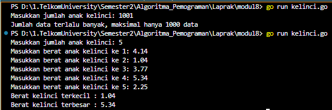

<h1 align = center > <b>  LAPORAN PRATIKUM  MODUL  10<br>  
PENCARIAN NILAI EKSTRIM PADA HIMPUNAN DATA </b></h1><p align = center><b>Nama : Alvin Aldino Rahmatullah || NIM : 103112430283</b></p>

<h1>Dasar Teori</h1>
Pencarian adalah suatu proses yang lazim dilakukan di dalam kehidupan sehari-hari. Contoh penggunaannya dalam kehidupan nyata sangat beragam, misalnya pencarian file di dalam directory komputer, pencarian suatu teks di dalam sebuah dokumen, pencarian buku pada rak buku, dan contoh lainnya. Pertama pada modul ini akan dipelajari salah satu algoritma pencarian nilai terkecil atau terbesar pada sekumpulan data, atau biasa disebut pencarian nilai ekstrim.
Ide algoritma sederhana sekali. Karena data harus diproses secara sekuensial, maka nilai atau indeks ke nilai maksimum dari data yang telah diproses disimpan untuk dibandingkan dengan data berikutnya. Nilai yang berhasil disimpan sampai algoritma tersebut berakhir adalah nilai maksimum yang dicari. Adapun algoritmanya secara umum adalah sebagai berikut:
1)  Jadikan data pertama sebagai nilai ekstrim
2)  Lakukan validasi nilai ekstrim dari data kedua hingga data terakhir.
    Apabila nilai ekstrim tidak valid, maka update nilai ekstrims tersebut dengan data yang dicek.
3)  Apabila semua data telah dicek, maka nilai ekstrim yang dimiliki adalah valid.
<h1>Unguided </h1>
**Soal 1**
> Sebuah program digunakan untuk mendata berat anak kelinci yang akan dijual ke pasar. Program ini menggunakan array dengan kapasitas 1000 untuk menampung data berat anak kelinci yang akan dijual.
>**Masukan :** terdiri dari sekumpulan bilangan, yang mana bilangan pertama adalah bilangan bulat N yang menyatakan banyaknya anak kelinci yang akan ditimbang beratnya. Selanjutnya N bilangan riil berikutnya adalah berat dari anak kelinci yang akan dijual.
>**Keluaran :** terdiri dari dua buah bilangan riil yang menyatakan berat kelinci terkecil dan terbesar.
>**-Code-**
```go
package main
import "fmt"

const MAX = 1000
type kelinci [MAX]float32
  
func hitungMinMax(data kelinci, n int) (float32, float32) {
    min := data[0]
    max := data[0]

    for i := 1; i < n; i++ {
        if data[i] < min {
            min = data[i]
        }

        if data[i] > max {
            max = data[i]
        }
    }
    return min, max
}

func main() {
    var data kelinci
    var n int

    fmt.Print("Masukkan jumlah anak kelinci: ")
    fmt.Scan(&n)

    if n > MAX {
        fmt.Print("Jumlah data terlalu banyak, maksimal hanya 1000 data")
        return

    }

    for i := 0; i < n; i++ {
        fmt.Print("Masukkan berat anak kelinci ke ", i+1, " : ")
        fmt.Scan(&data[i])
    }
  
    min, max := hitungMinMax(data, n)
  
    fmt.Println("Berat kelinci terkecil :", min)
    fmt.Print("Berat kelinci terbesar : ", max)
}
```
>
> **-Output-**
> 
> >\\
> 
>**-Penjelasan Program-**
> Program digunakan untuk mencatat dan berat dari anak kelinci tapi di awal program akan meminta berapa jumlah data kelinci yang akan di masukkan karena data tersebut di batasi sampai 1000, namun jika melebihi, maka program akan mempilkan print yang menyatakan bahwa nilai terlalu banyak. Sebenarnya bisa tanpa pakai if karena di awal telah menyatakan array hanya berisi 1000 data namun output yang ditampilkan akan berbeda yaitu "panic: runtime error: index out of range [1000] with length 1000" dan program nya juga berjalan berbeda, jika memakai memakai if program akan terhenti di awal sedangkan tidak memakai if array akan terus jalan namun di saat sampai mengisi data ke 1001 maka program baru berhenti dan akan menampilkan output lain. Setelah program menerima input data yang benar dari user, program akan menghitung berat terkecil dan terbesar dari semua data lalu akan dibandingkan. Data disimpan dalam array bertipe "kelinci" yang hanya dapat menampung maksimal 1000 data bertipe float32. . Fungsi "hitungMinMax" akan menerima array dan jumlah data sebagai parameter, lalu mengembalikan nilai minimum dan maksimum. Hasil akhir berupa berat kelinci terkecil dan terbesar.


---


>**Soal 2**
>Sebuah program digunakan untuk menentukan tarif ikan yang akan dijual ke pasar. Program ini menggunakan array dengan kapasitas 1000 untuk menampung data berat ikan yang akan dijual.
>**Masukan :** terdiri dari dua baris, yang mana baris pertama terdiri dari dua bilangan bulat x dan y. Bilangan x menyatakan banyaknya ikan yang akan dijual, sedangkan y adalah banyaknya ikan yang akan dimasukan ke dalam wadah. Baris kedua terdiri dari sejumlah x bilangan riil yang menyatakan banyaknya ikan yang akan dijual.
>**Keluaran :** terdiri dari dua baris. Baris pertama adalah kumpulan bilangan riil yang menyatakan total berat ikan di setiap wadah (jumlah wadah tergantung pada nilai x dan y, urutan ikan yang dimasukan ke dalam wadah sesuai urutan pada masukan baris ke-2). Baris kedua adalah sebuah bilangan riil yang menyatakan berat rata-rata ikan di setiap wadah.
>**-Code-**
```go
package main
import "fmt"

const MAX = 1000
type arrIkan [MAX]float64
  
func totalPerWadah(data arrIkan, x, y int) arrIkan {
    var hasil arrIkan
    jumlahWadah := x / y
    iData := 0

    for i := 0; i < jumlahWadah; i++ {
        var total float64 = 0
        for j := 0; j < y; j++ {
            total += data[iData]
            iData++
        }
        hasil[i] = total
    }
    return hasil
}

func rataRata(hasil arrIkan, jumlahWadah int) float64 {
    var total float64 = 0
    for i := 0; i < jumlahWadah; i++ {
        total += hasil[i]
    }
    return total / float64(jumlahWadah)
}

func main() {
    var data arrIkan
    var x, y int
  
    fmt.Print("Masukkan jumlah ikan dan jumlah ikan per wadah : ")
    fmt.Scan(&x, &y)
  
    if x > MAX {
        fmt.Println("Jumlah ikan terlalu banyak, maksimal hanya 1000.")
        return
    }

    if x%y != 0 {
        fmt.Println("Jumlah ikan tidak dapat dibagi rata ke dalam wadah.")
        return
    }

    for i := 0; i < x; i++ {
        fmt.Print("Berat ikan ke-", i+1, ": ")
        fmt.Scan(&data[i])
    }
  
    jumlahWadah := x / y
    total := totalPerWadah(data, x, y)
    rata := rataRata(total, jumlahWadah)

    for i := 0; i < jumlahWadah; i++ {
        fmt.Printf("Wadah %d : %.2f kg\n", i+1, total[i])
    }
    fmt.Printf("Rata-rata berat per wadah: %.2f kg", rata)
}
```
>
> **-Output-**
> 
 > >
 > 
>**-Penjelasan Program-**
>
>Program ini akan memasukkan data berat ikan yang akan dijual, setelah memasukkan jumlah ikan (x) dan jumlah ikan perwadah (y) user akan memasukkan berat ikan satu per satu yang nantinya akakn di proses untuk menghitung total berat ikan pada setiap wadah Program akan membagi ikan ke dalam beberapa wadah dengan isi tetap sebanyak ikan per wadah, lalu menghitung jumlah berat dalam tiap wadah. Setelah semua wadah terisi, program juga akan menghitung rata-rata total berat dari seluruh wadah. Jika jumlah ikan yang dimasukkan melebihi 1000, maka program akan menolak input dengan menampilkan "Jumlah ikan terlalu banyak, maksimal hanya 1000.". Selain itu, program juga memverifikasi bahwa jumlah ikan harus dapat dibagi rata ke dalam wadah, jika tidak proses tidak dilanjutkan. Hasil akhirnya berupa berat ikan dalam 1 wadah dan rata ratanya juga.


---


>**Soal 3**
>Pos Pelayanan Terpadu (posyandu) sebagai tempat pelayanan kesehatan perlu mencatat data berat balita (dalam kg). Petugas akan memasukkan data tersebut ke dalam array. Dari data yang diperoleh akan dicari berat balita terkecil, terbesar, dan reratanya.
>Buatlah program dengan spesifikasi subprogram sebagai berikut:
>
>
>
>Perhatikan sesi interaksi pada contoh berikut ini (teks bergaris bawah adalah input/read)
>
>
>
>**-Code-**
```go
package main
import "fmt"

const MAX = 100
type arrBalita [MAX]float64

func hitungMinMax(arr arrBalita, n int) (float64, float64) {
    min := arr[0]
    max := arr[0]
  
    for i := 1; i < n; i++ {
        if arr[i] < min {
            min = arr[i]
        }
        if arr[i] > max {
            max = arr[i]
        }
    }
    return min, max
}

func rataRata(arr arrBalita, n int) float64 {
    var total float64 = 0
    for i := 0; i < n; i++ {
        total += arr[i]
    }
    return total / float64(n)
}

func main() {
    var data arrBalita
    var n int

    fmt.Print("Masukkan jumlah data berat balita: ")
    fmt.Scan(&n)

    if n > MAX {
        fmt.Println("Jumlah data terlalu banyak, maksimal hanya 100 data.")
        return
    }
  
    for i := 0; i < n; i++ {
        fmt.Print("Masukkan berat balita ke ", i+1, ": ")
        fmt.Scan(&data[i])
    }
    
    min, max := hitungMinMax(data, n)
    rata := rataRata(data, n)

    fmt.Printf("Berat balita minimum: %.2f kg\n", min)
    fmt.Printf("Berat balita maksimum: %.2f kg\n", max)
    fmt.Printf("Rata-rata berat balita: %.2f kg\n", rata)
}
```
>
> **-Output-**
> 
> 
> 
>**-Penjelasan Program-**
> Program sangat berguna bagi petugas posyandu karena dapat mengelola data berat badan balita. User diminta memasukkan jumlah data berat balita yang maximalnya berjumlah 100 data, lalu memasukkan berat balita sesuai banyak jumlah data yang dimasukkan di awal dan setalah selesai program akan menampilkan output minimum, maximum, dan rata rata dalam bentuk kg. Namun jika user mencoba untuk memasukkan data melebihi kapasitas yang di berikan yaitu "MAX" yang berada di dalam array, program akan menampilkan output yang berbeda yaitu "Jumlah data terlalu banyak, maksimal hanya 100 data."