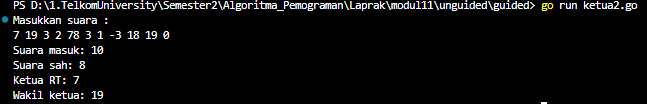

<h1 align = center > <b>  LAPORAN PRATIKUM  MODUL  11<br>  
PENCARIAN NILAI ACAK PADA HIMPUNAN DATA </b></h1><p align = center><b>Nama : Alvin Aldino Rahmatullah || NIM : 103112430283</b></p>

<h1>Dasar Teori</h1>
Pencarian secara sekuensial ini adalah pencarian yang dilakukan dari data pertama, kedua hingga terakhir secara satu persatu dan berurutan. Ciri khas dari pencarian ini adalah proses pencarian akan berhenti ketika data yang dicari ditemukan, walaupun masih terdapat data yang belum dicek nilainya. Algoritma ini dikenal dengan nama Sequential Search, karena prosesnya melakukan pengecekan setiap elemen array secara satu persatu dan sekuensial dari data pertama hingga ditemukan atau data terakhir.
Binary Search adalah: (dengan asumsi data terurut dari kecil membesar (ascending), dan data dengan indeks kecil ada di "kiri" dan indeks besar ada di "kanan") 

1) Ambil salah satu data dalam rentang data yang ada, algoritma di bawah menggunakan rentang dari kiri 𝒌𝒓 s.d. kanan 𝒌𝒏. Untuk kemudahan dan alasan lainnya, biasanya yang diambil adalah paling tengah dalam rentang tersebut.
   
2) Jika data terambil tersebut terlalu kecil, maka ubah/geser rentang data ke sebelah kanan posisi data tersebut. Ini karena jika data terambil terlalu kecil, maka semua data sebalah kirinya juga akan terlalu kecil dari yang ingin dicari.
  
3) Begitu juga sebaliknya jika data terambil terlalu besar.

   
<h1>Guided </h1>

**Soal 1**
> Sebuah toko memiliki daftar nama barang sebanyak n buah. Setiap nama barang disimpan dalam array bertipe string.Buatlah program untuk mencari apakah nama barang yang dicari (x) tersedia ditoko atau tidak. Pencarian dilakukan menggunakan algoritma sequanbtial search. Program mengembalikan true jika barang ditemukan, atau false jikat tidak ditemukan.
> 
>**-Code-**
> 
```go
package main
import "fmt"

func seqSearch(arr []string, n int, x string) bool {
    for i := 0; i < n; i++ {
        if arr[i] == x {
            return true
        }
    }
    return false
}
  
func main() {
    var n int
    var x string

    fmt.Print("Masukkan jumlah barang: ")
    fmt.Scan(&n)

    barang := make([]string, n)

    for i := 0; i < n; i++ {
        fmt.Print("Nama barang ke-", i+1, ": ")
        fmt.Scan(&barang[i])
    }
    
    fmt.Print("Masukkan nama barang yang dicari: ")
    fmt.Scan(&x)

    if seqSearch(barang, n, x) {
        fmt.Println("Barang ditemukan di toko.")
    } else {
        fmt.Println("Barang tidak ditemukan.")
    }
}
```

>**-Output-**
>
>  
>
>**-Penjelasan Program-**
>
>Program ini berguna untuk mencari barang barang dalam sebuah daftar data barang. Awalnya program akan meminta user untuk memasukkan jumlah barang yang akan nantinya dimasukkan, lalu user harus memasukkan nama nama barang sebanyak data yang dimasukkan yang nantinya akan disimpan ke dalam array yang bertipe string. Setelah semua nama barang dimasukkan, user dapat mencari kembali nama nama yang dimasukkan, namun jika user memasukkan nama yang  tidak ada dalam array maka program akan mengeluarkan "Barang tidak ditemukan.", namun jika barang ada maka mengeluarkan "Barang ditemukan di toko."


---


**Soal 2**

>buat program untuk membaca sebuah kalimat (string) dan sebuah karakter yang ingin dicari gunakan sequantial search untuk mencari apakah karakter tersebut terdapat di dalam kalimat. jika ya  tampilakan semua posisi indeks katerakter tersebut di kalimat.
>
>**-Code-**
>
```go
package main
import "fmt"

func seqSearch(kalimat string, karakter byte) []int {
    var posisi []int
    for i := 0; i < len(kalimat); i++ {
        if kalimat[i] == karakter {
            posisi = append(posisi, i)
        }
    }
    return posisi
}
  
func main() {
    var kalimat, karakter  string

    fmt.Print("Masukkan kalimat: ")
    fmt.Scan(&kalimat)

    fmt.Print("Masukkan karakter yang dicari: ")
    fmt.Scan(&karakter)
  
    posisi := seqSearch(kalimat, karakter[0])
  
    if len(posisi) > 0 {
        fmt.Print("Karakter ditemukan pada indeks: ")
        for i := 0; i < len(posisi); i++ {
            fmt.Print(posisi[i])
            if i != len(posisi)-1 {
                fmt.Print(", ")
            }
        }
        fmt.Println()
    } else {
        fmt.Println("Karakter tidak ditemukan.")
    }
}
```

>**-Output-**
>
>
>
>**-Penjelasan Program-**
>
>Program akan meminta user memasukkan sebuah kalimat bebas apa saja dan sebuah karakter. Setelah dimasukkakn user maka program akan memanggil "func seqSearch" yang bertugas untuk mencari apakah ada karakter di dalam sebuah kalimat tersebut. Jika karakter yang dicari ditemukan pada posisi ke "i", maka indeks ini akan disimpan dalam "posisi". Setelah pencarian selesai maka program akan menampilkan output  posisi karakter tersebut, tapi jika tidak maka program akan mengeluarkan "Karakter tidak ditemukan."


---


**Soal 3**

> Diketahui array mahasiswa terdiri atas n data bertipa struct yang menyimpan data nama dan nim mahasiswa. Array sudah terurut membesar berdasarkan nim. buatlah program untuk mencari nim tertentu menggunakan algoritma binary search dan mengembalikan indeks dari nim tersebut
> 
>**-Code-**
> 
```go
package main
import "fmt"
 
type Mahasiswa struct {
    nama, nim string
}
 
func Bmahasiswa(arr []Mahasiswa, n int, x string) int {
    var mid int
    kr := 0
    kn := n - 1
   
    for kr <= kn {
        mid = (kr + kn) / 2
        if x < arr[mid].nim {
            kn = mid - 1
        } else if x > arr[mid].nim {
            kr = mid + 1
        } else {
            return mid
        }
    }
    return -1
}

func main() {
    var n int
    var x strin

    fmt.Print("Masukkan jumlah mahasiswa: ")
    fmt.Scan(&n)

    mhs := make([]Mahasiswa, n)

    for i := 0; i < n; i++ {
        fmt.Println("Data mahasiswa ke :", i+1)
        fmt.Print("Nama: ")
        fmt.Scan(&mhs[i].nama)

        fmt.Print("NIM: ")
        fmt.Scan(&mhs[i].nim)
    }

    fmt.Print("Masukkan NIM yang dicari: ")
    fmt.Scan(&x)

    idx := Bmahasiswa(mhs, n, x)
    
    if idx != -1 {
        fmt.Print("Data mahasiswa ditemukan pada : ", idx)
    } else {
        fmt.Println("Data mahasiswa tidak ditemukan")
    }
}
```

>**-Output-**
>
>
>
>**-Penjelasan Program-**
>
> Program meminta  nim dan nama mahasiswa yang akan dimasukkan dimasukan kedalam array yang bertipe struct mahasiswa, setelah itu user akan diminta memasukkan nim yang ingin dicari. Fungsi "Bmahasiswa" melakukan pencarian biner terhadap elemen "nim" dalam array "arr", dengan menentukan batas kiri (kr)dan kanan (kn) dari indeks array. Pada setiap langkah, indeks tengah (mid) dihitung, lalu dibandingkan dengan x. Jika x lebih kecil pencarian digeser ke kiri, jika lebih besar ke kanan. jika pencarian selesai tanpa menemukan nim.


---


<h1>Unguided </h1>

**Soal 1**

> Pada pemilihan ketua RT yang baru saja berlangsung, terdapat 20 calon ketua yang bertanding memperebutkan suara warga. Perhitungan suara dapat segera dilakukan karena warga cukup mengisi formulir dengan nomor dari calon ketua RT yang dipilihnya. Seperti biasa, selalu ada pengisian yang tidak tepat atau dengan nomor pilihan di luar yang tersedia, sehingga data juga harus divalidasi. Tugas Anda untuk membuat program mencari siapa yang memenangkan pemilihan ketua RT.
> **Masukan :** hanya satu baris data saja, berisi bilangan bulat valid yang kadang tersisipi dengan data tidak valid. Data valid adalah integer dengan nilai di antara 1 s.d. 20 (inklusif). Data berakhir jika ditemukan sebuah bilangan dengan nilai 0.
> **Keluaran :** dimulai dengan baris berisi jumlah data suara yang terbaca, diikuti baris yang berisi berapa banyak suara yang valid. Kemudian sejumlah baris yang mencetak data para calon apa saja yang mendapatkan suara.
> 
> **-Code-**
> 
```go
package main
import "fmt"

type Calon struct {
    nomor, suara int
}

func sequentialSearch(arr []Calon, n int, x int) int {
    for i := 0; i < n; i++ {
        if arr[i].nomor == x {
            return i
        }
    }
    return -1
}

func main() {
    var suaraMasuk, suaraSah, x int
    var daftar []Calon

    fmt.Println("Masukkan suara :")
    for {
        fmt.Scan(&x)
        if x == 0 {
            break
        }

        if x >= 1 && x <= 20 {
            suaraSah++
            pos := sequentialSearch(daftar, len(daftar), x)
            if pos != -1 {
                daftar[pos].suara++
            } else {
                daftar = append(daftar, Calon{nomor: x, suara: 1})
            }
        }
        suaraMasuk++
    }

  
    fmt.Println("Suara masuk :", suaraMasuk)
    fmt.Println("Suara sah :", suaraSah)
    for i := 0; i < len(daftar); i++ {
        fmt.Println( daftar[i].nomor, ":", daftar[i].suara)
    }
}
```
>**-Output-**
>
>
>
>**-Penjelasan Program-**
>
>Program akan meminta user untuk memasukkan suara calon ketua RT secara satu per satu tapi jika sudah dirasa selesai harus di akhiri angka 0 untuk menghentikan program. Setiap suara akan di cek dengan aturan suara yang sah adalah suara yang dimulai dari 1 sampai 20, jika valid maka program akan memanggil "func sequentialSearch" untuk mengecek apakah nomor calon tersebut sudah ada dalam daftar. Jika sudah ada maka jumlah suaranya ditambah, jika belum maka calon tersebut ditambahkan ke dalam daftar dengan suara awal 1. Setelah semua suara diproses, program mengeluarkan total suara masuk, suara sah, dan  jumlah rincian suara yang diterima masing-masing calon.


---


**Soal 2**

> Berdasarkan program sebelumnya, buat program pilkart yang mencari siapa pemenang pemilihan ketua RT. Sekaligus juga ditentukan bahwa wakil ketua RT adalah calon yang mendapatkan suara terbanyak kedua. Jika beberapa calon mendapatkan suara terbanyak yang sama, ketua terpilih adalah dengan nomor peserta yang paling kecil dan wakilnya dengan nomor peserta terkecil berikutnya.
> **Masukan :** hanya satu baris data saja, berisi bilangan bulat valid yang kadang tersisipi dengan data tidak valid. Data valid adalah bilangan bulat dengan nilai di antara 1 s.d. 20 (inklusif). Data berakhir jika ditemukan sebuah bilangan dengan nilai 0.
> **Keluaran :** dimulai dengan baris berisi jumlah data suara yang terbaca, diikuti baris yang berisi berapa banyak suara yang valid. Kemudian tercetak calon nomor berapa saja yang menjadi pasangan ketua RT dan RW
> 
> **-Code-**
> 
```go
package main
import "fmt"

type Calon struct {
    nomor, suara int
}

func sequentialSearch(arr []Calon, n int, x int) int {
    for i := 0; i < n; i++ {
        if arr[i].nomor == x {
            return i
        }
    }
    return -1
}

func urutkanCalon(daftar []Calon) {
    n := len(daftar)

    for i := 0; i < n-1; i++ {
        for j := i + 1; j < n; j++ {
            if daftar[j].suara > daftar[i].suara || (daftar[j].suara == daftar[i].suara && daftar[j].nomor < daftar[i].nomor) {
                daftar[i], daftar[j] = daftar[j], daftar[i]
            }
        }
    }
}

func main() {
    var suaraMasuk, suaraSah, x int
    var daftar []Calon
  
    fmt.Println("Masukkan suara :")
    for {
        fmt.Scan(&x)
        if x == 0 {
            break
        }

        if x >= 1 && x <= 20 {
            suaraSah++
            pos := sequentialSearch(daftar, len(daftar), x)
            if pos != -1 {
                daftar[pos].suara++
            } else {
                daftar = append(daftar, Calon{nomor: x, suara: 1})
            }
        }
        suaraMasuk++
    }

    urutkanCalon(daftar)
  
    fmt.Println("Suara masuk:", suaraMasuk)
    fmt.Println("Suara sah:", suaraSah)
    fmt.Println("Ketua RT:", daftar[0].nomor)
    fmt.Println("Wakil ketua:", daftar[1].nomor)

}
```
>**-Output-**
>
>
>
>**-Penjelasan Program-**
>
>Program ini hampir sama dengan soal 1 dan ini adalah lajutannya. Pertama program akan meminta user untuk memasukkan suara berupa nomor calon ketua RT dan akan berhenti saat user memasukkan angka 0. Setiap suara yang valid yaitu 1 sampai 20 akan dicatat dan dihitung. Program akan memanggil "func sequentialSearch" untuk mengecek apakah calon sudah ada di dalam daftar, dan jika belum maka akan ditambahkan. Setelah semua suara diproses, program akan memanggil "func urutkanCalon" untuk mengurutkan daftar calon berdasarkan jumlah suara terbanyak dan nomor calon terkecil jika suara mereka sama. Kemudian program mencetak jumlah suara, suara sah, serta nomor calon yang menjadi Ketua dan Wakil Ketua RT berdasarkan hasil pungutan suara.

---


**Soal 3**

> Diberikan n data integer positif dalam keadaan terurut membesar dan sebuah integer lain k, apakah bilangan k tersebut ada dalam daftar bilangan yang diberikan? Jika ya, berikan indeksnya, jika tidak sebutkan "TIDAK ADA".
> **Masukan :** terdiri dari dua baris. Baris pertama berisi dua buah integer positif, yaitu n dan k. n menyatakan banyaknya data, dimana 1 < n <= 1000000. k adalah bilangan yang ingin dicari. Baris kedua berisi n buah data integer positif yang sudah terurut membesar
> **Keluaran :** terdiri dari satu baris saja, yaitu sebuah bilangan yang menyatakan posisi data yang dicari (k) dalam kumpulan data yang diberikan. Posisi data dihitung dimulai dari angka 0. Atau memberikan keluaran "TIDAK ADA" jika data k tersebut tidak ditemukan dalam kumpulan.
> Program yang dibangun harus menggunakan subprogram dengan mengikuti kerangka yang sudah diberikan berikut ini.
> 
> 
> 
> **-Code-**
> 
```go
package main
import "fmt"

const NMAX = 1000000
var data [NMAX]int

func main() {
    var n, k int
    fmt.Scan(&n, &k)

    isiArray(n)  
    idx := posisi(n, k)
    
    if idx != -1 {
        fmt.Println(idx)
    } else {
        fmt.Println("TIDAK ADA")
    }
}

func isiArray(n int) {
    for i := 0; i < n; i++ {
        fmt.Scan(&data[i])
    }
}
  
func posisi(n, k int) int {
    return binarySearch(data[:n], n, k)
}

func binarySearch(arr []int, n, x int) int {
    var mid int
    kiri := 0
    kanan := n - 1

    for kiri <= kanan {
        mid = (kiri + kanan) / 2
        if x < arr[mid] {
            kanan = mid - 1
        } else if x > arr[mid] {
            kiri = mid + 1
        } else {
            return mid
        }
    }
    return -1
}
```
>**-Output-**
>
>
>
>**-Penjelasan Program-**
>
>Program akan meminta user memasukkan dua buah nilai, yaitu jumlah data n dan bilangan yang ingin dicari yaitu k, kemudian dilanjutkan dengan memasukkan n denga data integer yang sudah terurut membesar jadi program hanya perlu menjalankan logika binary search. Setelah semua data dimasukkan, maka program akan memanggil "func binarySearch" yang bertugas untuk mencari apakah nilai k terdapat di dalam array. Jika nilai k ditemukan, maka program akan mengembalikan posisi indeks dari nilai tersebut. Namun jika nilai k tidak ada, maka program akan menampilkan "TIDAK ADA". 

---
