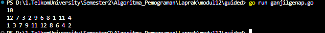
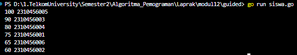
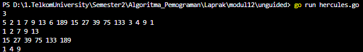
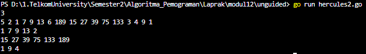
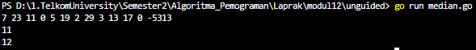
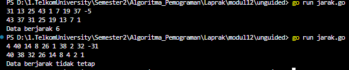
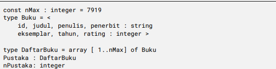
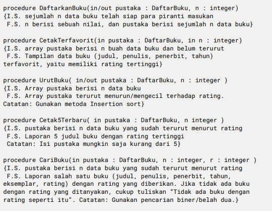
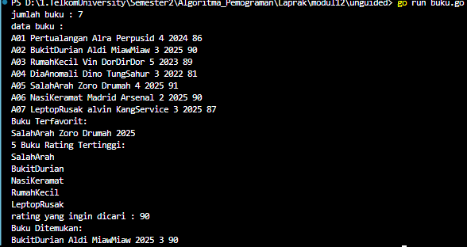

<h1 align = center > <b>  LAPORAN PRATIKUM  MODUL 12 & 13 <br>  
PENGURUTAN DATA </b></h1><p align = center><b>Nama : Alvin Aldino Rahmatullah || NIM : 103112430283</b></p>
<h1>Dasar Teori</h1>
Algoritma Selection Sort Pengurutan secara seleksi  adalah mencari nilai ekstrim pada sekumpulan data, kemudian meletakkan pada posisi yang seharusnya. Pada penjelasan berikut ini data akan diurut membesar (ascending), dan data dengan indeks kecil ada di "kiri" dan indeks besar ada di "kanan". 
1) Cari nilai terkecil di dalam rentang data tersisa 
2) Pindahkan/tukar tempat dengan data yang berada pada posisi paling kiri pada rentang data tersisa tersebut. 
3) Ulangi proses ini sampai tersisa hanya satu data saja.
Pengurutan secara insertion adalah menyisipkan suatu nilai pada posisi yang seharusnya. Berbeda dengan pengurutan seleksi, yang mana pada pengurutan ini tidak dilakukan pencarian nilai ekstrim terlebih dahulu, cukup memilih suatu nilai tertentu kemudian mencari posisinya secara sequential search. Pada penjelasan berikut ini data akan diurut mengecil (descending), dan data dengan indeks kecil ada di "kiri" dan indeks besar ada di "kanan"
<h1>Guided </h1>

**Soal 1**
>Diberikan `n` bilangan bulat positif. Buat program untuk mengurutkan angka ganjil secara **membesar (ascending)** dan angka genap secara **mengecil (descending)**, lalu gabungkan hasilnya dengan ganjil duluan.
>Gunakan **selection sort** dalam proses pengurutan.
>**Masukan:**
>  - Baris pertama berisi bilangan bulat `n` (1 ≤ n ≤ 100).
>  - Baris kedua berisi `n` bilangan bulat positif. 
>  **Keluaran:**
>  - Satu baris berisi angka ganjil terurut membesar diikuti angka genap terurut mengecil.

>**-Code-**
```go
package main
import "fmt"

func selectionSortAsc(arr []int, n int) {
    var i, j, idxMin, temp int
    for i = 0; i < n-1; i++ {
        idxMin = i
        for j = i + 1; j < n; j++ {
            if arr[j] < arr[idxMin] {
                idxMin = j
            }
        }
        temp = arr[i]
        arr[i] = arr[idxMin]
        arr[idxMin] = temp
    }
}
  
func selectionSortDesc(arr []int, n int) {
    var i, j, idxMax, temp int
    for i = 0; i < n-1; i++ {
        idxMax = i
        for j = i + 1; j < n; j++ {
            if arr[j] > arr[idxMax] {
                idxMax = j
            }
        }
        temp = arr[i]
        arr[i] = arr[idxMax]
        arr[idxMax] = temp
    }
}
  
func main() {
    var n, i int

    fmt.Scan(&n)
    arr := make([]int, n)
    for i = 0; i < n; i++ {
        fmt.Scan(&arr[i])
    }
  
    var ganjil []int
    var genap []int

    for i = 0; i < n; i++ {
        if arr[i]%2 == 1 {
            ganjil = append(ganjil, arr[i])
        } else {
            genap = append(genap, arr[i])
        }
    }
  
    selectionSortAsc(ganjil, len(ganjil))
    selectionSortDesc(genap, len(genap))

    for i = 0; i < len(ganjil); i++ {
        fmt.Print(ganjil[i], " ")
    }
    for i = 0; i < len(genap); i++ {
        fmt.Print(genap[i], " ")
    }
    fmt.Println()
}
```

>**-Output-**
>
>
>
>**-Penjelasan Program-**
>
>Program ini dibuat untuk mengurutkan sejumlah bilangan bulat positif dengan aturan khusus, yaitu bilangan ganjil harus diurutkan secara membesar (ascending) dan bilangan genap diurutkan secara mengecil (descending), lalu keduanya digabung dengan bilangan ganjil ditempatkan lebih dulu. Program dimulai dengan membaca jumlah bilangan "n", kemudian membaca "n" buah bilangan dan menyimpannya dalam array. Setelah itu, setiap bilangan diperiksa, jika ganjil, dimasukkan ke dalam array "ganjil", jika genap dimasukkan ke array "genap". Kedua array tersebut lalu diurutkan menggunakan "selection sort", jika ganjil menggunakan versi naik (ascending), dan jika genap versi turun (descending). Lalu seluruh isi aray ganjil dicetak terlebih dahulu, dilanjutkan dengan array genap. 


---


**Soal 2**
> Sebuah kelas memiliki sejumlah siswa yang telah mengikuti ujian. Tugas Anda adalah membuat program yang membaca nilai-nilai ujian siswa dengan struct berisikan `nim` dan `nilai`, lalu mengurutkannya dari yang tertinggi ke yang terendah menggunakan **insertion sort**.
> **Masukan:**
>   - Baris pertama adalah sebuah bilangan bulat `n` (1 ≤ n ≤ 100), menyatakan jumlah siswa.
>   - Baris berikutnya berisi `n` bilangan bulat yang masing-masing adalah nilai ujian (0–100).
> **Keluaran:**
> - Satu baris berisi nilai-nilai yang sudah terurut dari terbesar ke terkecil.

>**-Code-**
```go
package main
import "fmt"

type Siswa struct {
    nilai int
    nim   string
}

func insertionSort(data []Siswa, n int) {
    var temp Siswa
    var i, j int

    for i = 1; i < n; i++ {
        temp = data[i]
        j = i
        for j > 0 && temp.nilai > data[j-1].nilai {
            data[j] = data[j-1]
            j--
        }
        data[j] = temp
    }
}

func main() {
    data := []Siswa{
        {nilai: 75, nim: "2310456001"},
        {nilai: 60, nim: "2310456002"},
        {nilai: 90, nim: "2310456003"},
        {nilai: 80, nim: "2310456004"},
        {nilai: 100, nim: "2310456005"},
        {nilai: 65, nim: "2310456006"},
    }

    n := len(data)
    insertionSort(data, n)

    for i := 0; i < len(data); i++ {
        fmt.Println(data[i].nilai, data[i].nim)
    }
}
```

>**-Output-**
>
>
>
>**-Penjelasan Program-**
>
> Program bertugas untuk mengurutkan nilai-nilai ujian siswa dari yang tertinggi ke yang terendah. Setiap siswa direpresentasikan dengan sebuah struct siswa yang memiliki dua field yaitu nim dan nilai. Data siswa sudah tersedia langsung di dalam program dalam bentuk array slice dari Siswa. Proses pengurutan dilakukan dengan membandingkan nilai antar siswa. 


---


<h1>Unguided </h1>

##### Selection Sort


**Soal 1**
>Hercules, preman terkenal seantero ibukota, memiliki kerabat di banyak daerah. Tentunya Hercules sangat suka mengunjungi semua kerabatnya itu. Diberikan masukan nomor rumah dari semua kerabatnya di suatu daerah, buatlah program rumahkerabat yang akan menyusun nomor-nomor rumah kerabatnya secara terurut membesar menggunakan algoritma selection sort.
>**Masukan:**
>  dimulai dengan sebuah integer 𝒏 (0 < n < 1000), banyaknya daerah kerabat Hercules tinggal. Isi 𝒏 baris berikutnya selalu dimulai dengan sebuah integer 𝒎 (0 < m < 1000000) yang menyatakan banyaknya rumah kerabat di daerah tersebut, diikuti dengan rangkaian bilangan bulat positif, nomor rumah para kerabat.
>  **Keluaran:**
>  terdiri dari n baris, yaitu rangkaian rumah kerabatnya terurut membesar di masing masing daerah.

>**-Code-**
```go
package main
import "fmt"

func selectionSort(arr []int, panjang int) {
    var temp, i, j, idxMin int
  
    for i = 0; i < panjang-1; i++ {
        idxMin = i
  
        for j = i + 1; j < panjang; j++ {
            if arr[j] < arr[idxMin] {
                idxMin = j
            }
        }
        temp = arr[idxMin]
        arr[idxMin] = arr[i]
        arr[i] = temp
    }
}

func main() {
    var n, m int
    fmt.Scan(&n)

    for i := 0; i < n; i++ {
        fmt.Scan(&m)
        rumah := make([]int, m)
  
        for j := 0; j < m; j++ {
            fmt.Scan(&rumah[j])
        }
        selectionSort(rumah, m)

        for j := 0; j < m; j++ {
            fmt.Print(rumah[j])

            if j < m-1 {
                fmt.Print(" ")
            }
        }
        fmt.Println()
    }
}
```

>**-Output-**
>
> 
> 
>**-Penjelasan Program-**
>
>Program akan meminta user untuk memasukkan sebuah bilangan bulat "n" yang menyatakan jumlah daerah tempat tinggal kerabat Hercules. Selanjutnya, untuk setiap daerah, user diminta memasukkan jumlah rumah "m" yang kemudian diikuti dengan "m" buah bilangan bulat sebagai nomor-nomor rumah di daerah tersebut.
>Semua nomor rumah yang dimasukkan akan disimpan dalam slice "rumah", lalu diproses menggunakan fungsi "selectionSort", yaitu algoritma pengurutan dengan cara mencari nilai terkecil dan menukarnya ke posisi yang seharusnya. Pengurutan dilakukan dari indeks ke-0 hingga ke-(m-1). Setelah selesai, seluruh nomor rumah dalam setiap daerah ditampilkan dalam satu baris secara terurut membesar (ascending). 

---


**Soal 2**
>Belakangan diketahui ternyata Hercules itu tidak berani menyeberang jalan, maka selalu diusahakan agar hanya menyeberang jalan sesedikit mungkin, hanya diujung jalan. Karena nomor rumah sisi kiri jalan selalu ganjil dan sisi kanan jalan selalu genap, maka buatlah program kerabat dekat yang akan menampilkan nomor rumah mulai dari nomor yang ganjil lebih dulu terurut membesar dan kemudian menampilkan nomor rumah dengan nomor genap terurut mengecil.
>**Masukan:**
> dimulai dengan sebuah integer 𝒏 (0 < n < 1000), banyaknya daerah kerabat Hercules tinggal. Isi 𝒏 baris berikutnya selalu dimulai dengan sebuah integer 𝒎 (0 < m < 1000000) yang menyatakan banyaknya rumah kerabat di daerah tersebut, diikuti dengan rangkaian bilangan bulat positif, nomor rumah para kerabat. 
>  **Keluaran:**
>  terdiri dari n baris, yaitu rangkaian rumah kerabatnya terurut membesar untuk nomor ganjil, diikuti dengan terurut mengecil untuk nomor genap, di masing-masing daerah.
>  **Keterangan:**
>  Terdapat 3 daerah dalam contoh masukan. Baris kedua berisi campuran bilangan ganjil dan genap. Baris berikutnya hanya berisi bilangan ganjil, dan baris terakhir hanya berisi bilangan genap.
> **Petunjuk:**
>  - Waktu pembacaan data, bilangan ganjil dan genap dipisahkan ke dalam dua array yang berbeda, untuk kemudian masing-masing diurutkan tersendiri. 
>  - Atau, tetap disimpan dalam satu array, diurutkan secara keseluruhan. Tetapi pada waktu pencetakan, mulai dengan mencetak semua nilai ganjil lebih dulu, kemudian setelah selesai cetaklah semua nilai genapnya.

>**-Code-**
```go
package main
import "fmt"
  
func selectionSort(arr []int, panjang int) {
    var temp, i, j, idxMin int
  
    for i = 0; i < panjang-1; i++ {
        idxMin = i
        for j = i + 1; j < panjang; j++ {
            if arr[j] < arr[idxMin] {
                idxMin = j
            }
        }
  
        temp = arr[idxMin]
        arr[idxMin] = arr[i]
        arr[i] = temp
    }
}

func main() {
    var n, m, angka int
    fmt.Scan(&n)

    for i := 0; i < n; i++ {
        fmt.Scan(&m)
        var ganjil, genap []int

        for j := 0; j < m; j++ {
            fmt.Scan(&angka)
            
            if angka % 2 == 1 {
                ganjil = append(ganjil, angka)
            } else {
                genap = append(genap, angka)
            }
        }

        selectionSort(ganjil, len(ganjil))
        selectionSort(genap, len(genap))
  
        for j := 0; j < len(ganjil); j++ {
            fmt.Print(ganjil[j], " ")
        }
  
        for j := len(genap) - 1; j >= 0; j-- {
            fmt.Print(genap[j])
            if j != 0 {
                fmt.Print(" ")
            }
        }
        fmt.Println()
    }
}
```
>**-Output-**
>
>
>
>**-Penjelasan Program-**
>
>Program diawali dengan input jumlah daerah n. Untuk setiap daerah, user akan memasukkan jumlah rumah m, diikuti oleh m buah nomor rumah. Program kemudian memisahkan nomor rumah ke dalam dua array berbeda:
> - ganjil untuk nomor rumah yang ganjil (angka % 2 == 1)

>Masing-masing array diurutkan dengan fungsi selectionSort, di mana ganjil diurutkan secara membesar (ascending), dan `genap` diurutkan membesar lalu dicetak dari belakang agar hasil akhirnya menurun (descending). Output yang dihasilkan berupa satu baris per daerah yang menampilkan nomor rumah ganjil yang telah diurutkan diikuti oleh nomor rumah genap yang juga telah diurutkan terbalik.


---


**Soal 3**
> Kompetisi pemrograman yang baru saja berlalu diikuti oleh 17 tim dari berbagai perguruan tinggi ternama. Dalam kompetisi tersebut, setiap tim berlomba untuk menyelesaikan sebanyak mungkin problem yang diberikan. Dari 13 problem yang diberikan, ada satu problem yang menarik. Problem tersebut mudah dipahami, hampir semua tim mencoba untuk menyelesaikannya, tetapi hanya 3 tim yang berhasil. Apa sih problemnya? "Median adalah nilai tengah dari suatu koleksi data yang sudah terurut. Jika jumlah data genap, maka nilai median adalah rerata dari kedua nilai tengahnya. Pada problem ini, semua data merupakan bilangan bulat positif, dan karenanya rerata nilai tengah dibulatkan ke bawah." Buatlah program median yang mencetak nilai median terhadap seluruh data yang sudah terbaca, jika data yang dibaca saat itu adalah 0.
>**Masukan:**
> berbentuk rangkaian bilangan bulat. Masukan tidak akan berisi lebih dari 1000000 data, tidak termasuk bilangan 0. Data 0 merupakan tanda bahwa median harus dicetak, tidak termasuk data yang dicari mediannya. Data masukan diakhiri dengan bilangan bulat -5313. 
>  **Keluaran:**
>  Sampai bilangan 0 yang pertama, data terbaca adalah 7 23 11, setelah tersusun: 7 11 23, maka median saat itu adalah 11.
>  **Keterangan:**
>  Sampai bilangan 0 yang kedua, data adalah 7 23 11 5 19 2 29 3 13 17, setelah tersusun diperoleh: 2 3 5 7 11 13 17 19 23 29. Karena ada 10 data, genap, maka median adalah (11+13)/2=12.
> **Petunjuk:**
>  Untuk setiap data bukan 0 (dan bukan marker -5313541) simpan ke dalam array, Dan setiap kali menemukan bilangan 0, urutkanlah data yang sudah tersimpan dengan menggunakan metode insertion sort dan ambil mediannya.

>**-Code-**
```go
package main
import "fmt"

func selectionSort(arr []int, panjang int) {
    var temp, i, j, idxMin int
  
    for i = 0; i < panjang-1; i++ {
        idxMin = i
        for j = i + 1; j < panjang; j++ {
            if arr[j] < arr[idxMin] {
                idxMin = j
            }
        }
        temp = arr[idxMin]
        arr[idxMin] = arr[i]
        arr[i] = temp
    }
}
  
func insertionSort(arr []int, panjang int) {
    var i, j, temp int
    for i = 1; i < panjang; i++ {
        temp = arr[i]
        j = i

        for j > 0 && temp < arr[j-1] {
            arr[j] = arr[j-1]
            j--
        }
        arr[j] = temp
    }
}

func hitungMedian(data []int) int {
    n := len(data)
    insertionSort(data, n)
    if n%2 == 1 {
        return data[n/2]
    } else {
        return (data[n/2-1] + data[n/2]) / 2
    }
}

func main() {
    var input int
    var data []int

    for {
        fmt.Scan(&input)
        if input == -5313 {
            break
        } else if input == 0 {
            if len(data) > 0 {
                copyData := make([]int, len(data))
                copy(copyData, data)
                fmt.Println(hitungMedian(copyData))
            }
        } else if input > 0 {
            data = append(data, input)
        }
    }
}
```

>**-Output-**
>
>
>
>**-Penjelasan Program-**
>
> Program ini membaca serangkaian bilangan bulat satu per satu dari input. Semua angka positif disimpan dalam array data. Bila ditemukan angka 0, maka program akan menghitung **median** dari elemen-elemen yang telah tersimpan. Fungsi hitungMedian akan menyalin array, mengurutkannya menggunakan insertionSort (dari kecil ke besar), lalu menghitung median. Setiap kali angka 0 dimasukkan, median akan dicetak. Proses terus berlangsung hingga angka -5313 dimasukkan, yang menjadi tanda akhir program. Median selalu dihitung dari seluruh data yang telah dimasukkan **sebelum** angka 0.


___
#### Insertion Sort
**Soal 1**
>Buatlah sebuah program yang digunakan untuk membaca data integer seperti contoh yang diberikan di bawah ini, kemudian diurutkan (menggunakan metoda insertion sort), dan memeriksa apakah data yang terurut berjarak sama terhadap data sebelumnya.
>**Masukan:**
>  terdiri dari sekumpulan bilangan bulat yang diakhiri oleh bilangan negatif. Hanya bilangan non negatif saja yang disimpan ke dalam array.
>  **Keluaran:**
>  - terdiri dari dua baris. Baris pertama adalah isi dari array setelah dilakukan pengurutan, sedangkan baris kedua adalah status jarak setiap bilangan yang ada di dalam array. "Data berjarak x" atau "data berjarak tidak tetap".

>**-Code-**
```go
package main
import "fmt"

func insertionSort(arr []int, n int) {
    var temp, i, j int
    
    for i = 1; i < n; i++ {
        temp = arr[i]
        j = i
        for j > 0 && temp > arr[j-1] {
            arr[j] = arr[j-1]
            j--
        }
        arr[j] = temp
    }
}
  
func main() {
    var input int
    var data []int

    for {
        fmt.Scan(&input)
        if input < 0 {
            break
        }
        data = append(data, input)
    }
    
    n := len(data)
    if n == 0 {
        fmt.Println("Tidak ada data.")
        return
    }

    insertionSort(data, n)

    for i := 0; i < n; i++ {
        fmt.Print(data[i])
        if i < n-1 {
            fmt.Print(" ")
        }
    }
    fmt.Println()
  
    jarakTetap := true
    jarak := data[0] - data[1]
    
    for i := 2; i < n; i++ {
        if data[i-1]-data[i] != jarak {
            jarakTetap = false
            break
        }
    }

    if jarakTetap {
        fmt.Print("Data berjarak ", jarak)
    } else {
        fmt.Println("Data berjarak tidak tetap")
    }
}
```

>**-Output-**
>
>

>**-Penjelasan Program-**
>
>Program akan terus meminta input bilangan bulat dari user hingga ditemukan angka negatif. Semua angka yang tidak negatif akan disimpan dalam "data". Setelah itu, array "data" akan diurutkan secara menurun (descending) menggunakan algoritma "insertionSort", yaitu algoritma yang menyisipkan elemen ke dalam bagian array yang sudah terurut. Setelah pengurutan selesai, program mengeluarkan isi array yang telah diurutkan. Kemudian, program menghitung selisih jarak antara elemen pertama dan kedua sebagai patokan, lalu membandingkan selisih ini dengan selisih antara pasangan elemen-elemen berikutnya Jika semua selisih tersebut sama, maka akan ditampilkan Data berjarak sebanyak jaraknya tersebut. Jika tidak maka program mencetak "Data berjarak tidak tetap".


---


**Soal 2**
>Sebuah program perpustakaan digunakan untuk mengelola data buku di dalam suatu perpustakaan. Misalnya terdefinisi struct dan array seperti berikut ini
>
>

>**Masukan:**
>  terdiri dari beberapa baris. Baris pertama adalah bilangan bulat N yang menyatakan banyaknya data buku yang ada di dalam perpustakaan. N baris berikutnya, masing-masingnya adalah data buku sesuai dengan atribut atau field pada struct. Baris terakhir adalah bilangan bulat yang menyatakan rating buku yang akan dicari.
>  **Keluaran:**
>  terdiri dari beberapa baris. Baris pertama adalah data buku terfavorit, baris kedua adalah lima judul buku dengan rating tertinggi, selanjutnya baris terakhir adalah data buku yang dicari sesuai rating yang diberikan pada masukan baris terakhir.
>  Lengkapi subprogram-subprogram dibawah ini, sesuai dengan I.S. dan F.S yang diberikan.
>
>>

>**-Code-**
```go
package main
import "fmt"

const nMax = 7919
  
type Buku struct {
    id, judul, penulis, penerbit string
    eksemplar, tahun, rating     int
}

type DaftarBuku [nMax]Buku
func DaftarkanBuku(pustaka *DaftarBuku, n int) {
    for i := 0; i < n; i++ {
        fmt.Scan(&pustaka[i].id)
        fmt.Scan(&pustaka[i].judul)
        fmt.Scan(&pustaka[i].penulis)
        fmt.Scan(&pustaka[i].penerbit)
        fmt.Scan(&pustaka[i].eksemplar)
        fmt.Scan(&pustaka[i].tahun)
        fmt.Scan(&pustaka[i].rating)
    }
}
  
func CetakTerfavorit(pustaka DaftarBuku, n int) {
    maxIdx := 0
    for i := 1; i < n; i++ {
        if pustaka[i].rating > pustaka[maxIdx].rating {
            maxIdx = i
        }
    }
    fmt.Println("Buku Terfavorit:")
    fmt.Println(pustaka[maxIdx].judul, pustaka[maxIdx].penulis, pustaka[maxIdx].penerbit, pustaka[maxIdx].tahun)
}
  
func UrutBuku(pustaka *DaftarBuku, n int) {
    var temp Buku
    var i, j int

    for i = 1; i < n; i++ {
        temp = pustaka[i]
        j = i
        for j > 0 && temp.rating > pustaka[j-1].rating {
            pustaka[j] = pustaka[j-1]
            j--
        }
        pustaka[j] = temp
    }
}

func Cetak5Terbaru(pustaka DaftarBuku, n int) {
    fmt.Println("5 Buku Rating Tertinggi:")
    limit := 5

    if n < 5 {
        limit = n
    }
    for i := 0; i < limit; i++ {
        fmt.Println(pustaka[i].judul)
    }
}

func CariBuku(pustaka DaftarBuku, n int, r int) {
    low := 0
    high := n - 1
  
    for low <= high {
        mid := (low + high) / 2
        if pustaka[mid].rating == r {
            fmt.Println("Buku Ditemukan:")
            fmt.Println(pustaka[mid].judul, pustaka[mid].penulis, pustaka[mid].penerbit, pustaka[mid].tahun, pustaka[mid].eksemplar, pustaka[mid].rating)
            return
            
        } else if pustaka[mid].rating < r {
            high = mid - 1
        } else {
            low = mid + 1
        }
    }
    fmt.Println("Tidak ada buku dengan rating seperti itu")
}

func main() {
    var n, r int
    var pustaka DaftarBuku
  
    fmt.Print("jumlah buku : ")
    fmt.Scan(&n)

    fmt.Println("data buku :")
    DaftarkanBuku(&pustaka, n)  
    CetakTerfavorit(pustaka, n)
    UrutBuku(&pustaka, n)
    Cetak5Terbaru(pustaka, n)

    fmt.Print("rating yang ingin dicari : ")
    fmt.Scan(&r)
    CariBuku(pustaka, n, r)
}
```

>**-Output-**
>
>
>
>**-Penjelasan Program-**
>
>Program dimulai dengan membaca jumlah buku yang ada di perpustakaan, kemudian setiap data buku dibaca satu per satu dan disimpan ke dalam array pustaka yang bertipe DaftarBuku. Setiap buku terdiri dari ID, judul, penulis, penerbit, jumlah eksemplar, tahun terbit, dan rating. Setelah seluruh data buku dimasukkan menggunakan prosedur DaftarkanBuku, program mencari buku dengan rating tertinggi dan menampilkannya sebagai buku terfavorit menggunakan prosedur CetakTerfavorit. Langkah selanjutnya, semua buku diurutkan berdasarkan rating menggunakan prosedur UrutBuku, yang mengimplementasikan algoritma insertion sort descending. Setelah proses pengurutan selesai, lima judul buku dengan rating tertinggi ditampilkan melalui prosedur Cetak5Terbaru. Lalu program membaca sebuah rating yang ingin dicari oleh pengguna. Jika ditemukan, informasi lengkap buku tersebut ditampilka, jika tidak maka ditampilkan pesan bahwa tidak ada buku dengan rating tersebut.

