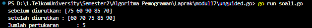
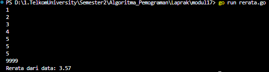
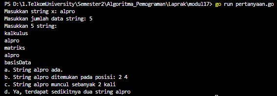
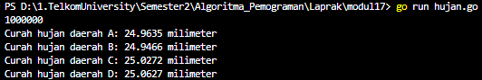
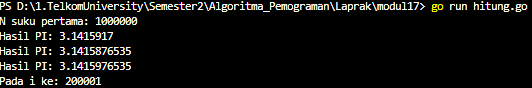
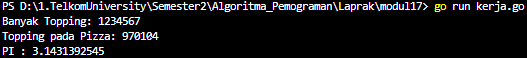

<h1 align = center > <b>  LAPORAN PRATIKUM  MODUL 17 <br>  
SKEMA PEMROSESAN SEKUENSIAL</b></h1><p align = center><b>Nama : Alvin Aldino Rahmatullah || NIM : 103112430283</b></p>
<h1>Dasar Teori</h1>
Pengantar Skema Pemrosesan Sekuensial yang dipersenjatai bentuk perulangan dan bentuk percabangan, banyak problem komputasi yang dapat diselesaikan. Dengan cara ini data dapat dibaca, dianalisis, dan diproses secara bertahap sesuai urutan kemunculannya. 
<h1>Guided </h1>

**Soal 1**
>Aldi memiliki daftar nilai ulangan matematika temannya: 75, 60, 90, 85, dan 70. Ia ingin mengurutkan nilai tersebut dari yang terkecil ke yang terbesar menggunakan **metode Bubble Sort**.
>
>**-Code-**

```go
package main
import "fmt"

func bubbleSort(arr []int) int {
    swapCount := 0
    n := len(arr)
    for i := 0; i < n-1; i++ {
        for j := 0; j < n-1-i; j++ {
            if arr[j] > arr[j+1] {
                arr[j], arr[j+1] = arr[j+1], arr[j]
                swapCount++
            }
        }
    }
    return swapCount
}

func main() {
    nilai := []int{75, 60, 90, 85, 70}
    fmt.Println("sebelum diurutkan:", nilai)
    jumlahSwap := bubbleSort(nilai)
    fmt.Println("setelah diurutkan :", nilai)
    fmt.Println("Jumlah pertukaran      :", jumlahSwap)
}
```
>
>**-Output-**
>
>
>
>**-Penjelasan Program-**
>
>Program ini mengurutkan nilai ulangan teman Aldi menggunakan metode Bubble Sort, yaitu dengan membandingkan pasangan nilai yang berdekatan dan menukarnya. Proses ini diulang hingga seluruh nilai tersusun dari yang terkecil ke terbesar. Selain itu, program juga menghitung dan menampilkan jumlah pertukaran "swap" yang terjadi selama proses pengurutan.
<h1>Unguided </h1>

**Soal 1**
>Diberikan sejumlah bilangan real yang diakhiri dengan marker 9999, cari rerata dari bilanganbilangan tersebut.
>
>**-Code-**
```go
package main
import "fmt"

func main() {
    var angka,total float64
    var jumlah int

    for {
        fmt.Scanln(&angka)
        if angka == 9999 {
            break
        }
        total += angka
        jumlah++
    }

    if jumlah == 0 {
        fmt.Println("Masukkan angka selain 9999")
    } else {
        rerata := total / float64(jumlah)
        fmt.Printf("Rerata dari data: %.2f\n", rerata)
    }
}
```

>**-Output-**
>
>
>
>**-Penjelasan Program-**
>
>Program ini menghitung rata-rata dari sekumpulan bilangan real yang diakhiri dengan marker 9999. Selama input bukan 9999 maka bilangan akan dijumlahkan dan jumlah data dihitung. Setelah marker dimasukkan, program akan menghitung dan menampilkan rata-rata. 


---


**Soal 2**
>Diberikan string x dan n buah string. x adalah data pertama yang dibaca, n adalah data bilangan yang dibaca kedua, dan n data berikutnya adalah data string. Buat algoritma untuk menjawab pertanyaan berikut:
>
>a. Apakah string x ada dalam kumpulan n data string tersebut?
>
>b. Pada posisi ke berapa string x tersebut ditemukan?
>
>c. Ada berapakah string x dalam kumpulan n data string tersebut?
>
>d. Adakah sedikitnya dua string x dalam n data string tersebut?
>
>
>**-Code-**
```go
package main
import "fmt"

func main() {
    var x string
    var n, jumlahMuncul int
    var data [100]string
    var posisi [100]int

    fmt.Print("Masukkan string x: ")
    fmt.Scanln(&x)

    fmt.Print("Masukkan jumlah data string: ")
    fmt.Scanln(&n)

    fmt.Println("Masukkan", n, "string:")

    for i := 0; i < n; i++ {
        fmt.Scanln(&data[i])
    }

    for i := 0; i < n; i++ {
        if data[i] == x {
            posisi[jumlahMuncul] = i + 1
            jumlahMuncul++
        }
    }
  
    if jumlahMuncul > 0 {
        fmt.Println("a. String", x, "ada.")
    } else {
        fmt.Println("a. String", x, "tidak ada.")
    }

    if jumlahMuncul > 0 {
        fmt.Print("b. String ", x, " ditemukan pada posisi: ")
        for i := 0; i < jumlahMuncul; i++ {
            fmt.Print(posisi[i], " ")
        }
        fmt.Println()
    } else {
        fmt.Println("b. String ", x, " tidak ditemukan, jadi tidak memiliki posisi.")
    }

    fmt.Println("c. String", x, "muncul sebanyak", jumlahMuncul, "kali")

    if jumlahMuncul >= 2 {
        fmt.Println("d. Ya, terdapat sedikitnya dua string", x)
    } else {
        fmt.Println("d. Tidak, tidak ada dua atau lebih string", x)
    }
}
```

>**-Output-**
>
>
>
>**-Penjelasan Program-**
>
>Program ini membaca string "x", lalu "n" untuk jumlah string yang akan di input, dan memakai konsep percabangan, yang akan memeriksa apakah "x" ada dalam kumpulan tersebut. Jika ditemukan, program menampilkan semua posisi kemunculan "x" , jumlah kemunculannya, dan apakah "x" muncul setidaknya dua kali. Semua data disimpan dalam array dan hasil outputntya berupa jawaban yang ditanyakan di soal.


---


**Soal 3**
>Empat daerah A, B, C, dan D yang berdekatan ingin mengukur curah hujan. Keempat daerah tersebut digambarkan pada 4 buah bidang.
>Misal curah hujan dihitung berdasarkan banyaknya tetesan air hujan. Setiap tetesan berukuran 0.0001 ml curah hujan. Tetesan air hujan turun secara acak dari titik (0,0) sampai (1,1). Jika diterima input yang menyatakan banyaknya tetesan air hujan. Tentukan curah hujan untuk keempat daerah tersebut. Buatlah program yang menerima input berupa banyaknya tetesan air hujan. Kemudian buat koordinat/titik (x, y) secara acak dengan menggunakan fungsi rand.Float64(). Hitung dan tampilkan banyaknya tetesan yang jatuh pada daerah A, B, C dan D. Konversikan satu tetesan berukuran 0.0001 milimeter
>
>**Catatan :** Lihat lampiran untuk informasi menggunakan paket math/rand untuk menggunakan rand.Float64() yang menghasilkan bilangan riil acak [0..1] 
>
>**-Code-**
```go
package main
import (
    "fmt"
    "math/rand"
    "time"
)

func main() {
    var jumlahTetes int
    var countA, countB, countC, countD int

    fmt.Scan(&jumlahTetes)
  
    rand.Seed(time.Now().UnixNano())
  
    for i := 0; i < jumlahTetes; i++ {
        x := rand.Float64()
        y := rand.Float64()

        if x < 0.5 && y >= 0.5 {
            countA++
        } else if x >= 0.5 && y >= 0.5 {
            countB++
        } else if x < 0.5 && y < 0.5 {
            countC++
        } else if x >= 0.5 && y < 0.5 {
            countD++
        }
    }
  
    ukuranTetesan := 0.0001
    curahA := float64(countA) * ukuranTetesan
    curahB := float64(countB) * ukuranTetesan
    curahC := float64(countC) * ukuranTetesan
    curahD := float64(countD) * ukuranTetesan

    fmt.Printf("Curah hujan daerah A: %.4f milimeter\n", curahA)
    fmt.Printf("Curah hujan daerah B: %.4f milimeter\n", curahB)
    fmt.Printf("Curah hujan daerah C: %.4f milimeter\n", curahC)
    fmt.Printf("Curah hujan daerah D: %.4f milimeter\n", curahD)
}
```

>**-Output-**
>
>
>
>**-Penjelasan Program-**
>Program ini mensimulasikan tetesan air hujan yang jatuh secara acak di bidang koordinat dari titik (0,0) hingga (1,1), kemudian menghitung banyaknya tetesan yang jatuh di empat daerah A, B, C, dan D berdasarkan posisi kuadran koordinat. Titik-titik acak dihasilkan menggunakan "rand.Float64()", dan setiap titik diklasifikasikan ke salah satu daerah berdasarkan nilai "x" dan "y". Setelah semua titik dihitung, program mengalikan jumlah tetesan di masing-masing daerah dengan 0.0001 untuk mengubahnya ke satuan milimeter, lalu mencetak curah hujan untuk setiap daerah


---


**Soal 4**
>Berdasarkan formula Leibniz, nilai π dapat dinyatakan sebagai deret harmonik ganti sebagai berikut:
>
$$
1 − 1/3 + 1/5 − 1/7 + 1/9 − ⋯ = 𝜋/4
$$

>Suku ke-i dinyatakan sebagai 𝑆𝑖 dan jumlah deret adalah 𝑆. Apabila diketahui suku pertama 𝑆1 = 1, suku kedua 𝑆2 = −1/3 . Temukan rumus untuk suku ke-𝒊 atau 𝑆𝑖 . Berdasarkan rumus tersebut, buatlah program yang menghitung 𝑆 untuk 1000000 suku pertama
>Perhatikan contoh sesi interaksi program di bawah ini (teks cetak miring  adalah input/read):
>

| N suku pertama: *1000000* |     |
| ------------------------- | --- |
| Hasil PI: 3.1415951       |     |
Setelah jalan, modifikasi program tersebut agar menyimpan nilai dua suku yang bersebelahan, 𝑆𝑖 dan 𝑆𝑖+1. Buatlah agar program tersebut sekarang berhenti apabila selisih dari kedua suku tersebut tidak lebih dari 0.00001. Perhatikan contoh sesi interaksi program di bawah ini (teks bercetak miring adalah input/read):

| N suku pertama: *1000000* |     |
| ------------------------- | --- |
| Hasil PI: 3.1415876535    |     |
| Hasil PI: 3.1415976535    |     |
| Pada i ke: 200001         |     |

>
>**-Code-**
```go
package main
import (
    "fmt"
    "math"
)

func pembulatan(x float64) float64 {
    return math.Trunc(x*1e10) / 1e10
}
   
func hitungPI(n int) float64 {
    total := 0.0
    tanda := 1.0
    for i := 0; i < n; i++ {
        total += tanda / float64(2*i+1)
        tanda = -tanda
    }
    return pembulatan(total * 4)
}

func hitung(n int) (float64, float64, int) {
    total, sebelumnya := 0.0, 0.0
    tanda := 1.0

    for i := 0; i < n; i++ {
        total += tanda / float64(2*i+1)
        tanda = -tanda
        sekarang := total * 4

        if i > 0 && math.Abs(sekarang-sebelumnya) < 0.00001 {
            return pembulatan(sebelumnya), pembulatan(sekarang), i + 1
        }
        sebelumnya = sekarang
    }
    return pembulatan(sebelumnya), pembulatan(sebelumnya), n
}

func main() {
    var suku int
    fmt.Print("N suku pertama: ")
    fmt.Scan(&suku)

    pi := hitungPI(suku)
    fmt.Printf("Hasil PI: %.7f\n", pi)

    pi1, pi2, iter := hitung(suku)

    fmt.Printf("Hasil PI: %.10f\n", pi1)
    fmt.Printf("Hasil PI: %.10f\n", pi2)
    fmt.Print("Pada i ke: ", iter)
}
```

>**-Output-**
>
>
>
>**-Penjelasan Program-**
>
>Program ini menghitung nilai π menggunakan deret Leibniz dengan menjumlahkan suku ke-i dari bentuk $S_i = (-1)^{i+1} / (2i - 1)$ untuk "n" suku pertama. Setelah itu, program dimodifikasi untuk menghentikan perhitungan saat dua nilai π berturut-turut memiliki selisih kurang dari 0.00001. Nilai π dihitung dengan mengalikan total jumlah deret dengan 4, dan hasil dua nilai terakhir serta iterasi keberapa π dianggap konvergen ditampilkan sebagai output.


---


**Soal 5**
>Monti bekerja pada sebuah kedai pizza, saking ramainya kedai tersebut membuat Monti tidak ada waktu untuk bersantai. Suatu ketika saat sedang menaburkan topping pada pizza yang diletakkan pada wadah berbentuk persegi, terpikirkan oleh Monti cara menghitung berapa banyak topping yang dia butuhkan, dan cara menghitung nilai 𝝅. Ilustrasi seperti gambar yang diberikan di bawah, topping adalah lingkaran-lingkaran kecil. Ada yang tepat berada di atas pizza, dan ada yang jatuh di dalam kotak tetapi berada di luar pizza. Apabila luas pizza yang memiliki radius r adalah 𝐿𝑢𝑎𝑠𝑃𝑖𝑧𝑧𝑎 = 𝜋𝑟 2 dan luas wadah pizza yang memiliki panjang sisi 𝑑 = 2𝑟 adalah 𝐿𝑢𝑎𝑠𝑊𝑎𝑑𝑎ℎ = 𝑑 2 = 4𝑟 2 , maka diperoleh perbandingan luas kedua bidang tersebut
>
$$
𝐿𝑢𝑎𝑠Pizza/luazWadah = 𝜋𝑟^2/ 4𝑟^2 = 𝜋 /4
$$

Persamaan lingkaran adalah (𝑥 − 𝑥𝑐) 2 + (𝑦 − 𝑦𝑐) 2 = 𝑟 2 dengan titik pusat lingkaran adalah (𝑥𝑐 , 𝑦𝑐). Suatu titik sembarang (𝑥, 𝑦) dikatakan berada di dalam lingkaran apabila memenuhi ketidaksamaan:
>
$$
(𝑥 − 𝑥_𝑐)^2 + (𝑦 − 𝑦_𝑐)^2 ≤ 𝑟^2
$$

Pada ilustrasi topping berbentuk bulat kecil merah dan biru pada gambar adalah titik-titik (𝑥, 𝑦) acak pada sebuah wadah yang berisi pizza. Dengan jumlah yang sangat banyak dan ditaburkan merata (secara acak), maka kita bisa mengetahui berapa banyak titik/topping yang berada tepat di dalam pizza menggunakan ketidaksamaan di atas. Buatlah program yang menerima input berupa banyaknya topping yang akan ditaburkan, kemudian buat titik acak (𝑥, 𝑦) dari bilangan acak riil pada kisaran nilai 0 hingga 1 sebanyak topping yang diberikan. Hitung dan tampilkan berapa banyak topping yang jatuh tepat di atas pizza. Titik pusat pizza adalah (0.5, 0.5) dan jari-jari pizza adalah 0.5 satuan wadah.
Apabila topping yang ditaburkan oleh Monti secara merata berjumlah yang sangat banyak, maka topping akan menutupi keseluruhan wadah pizza. Luas Pizza sebanding dengan topping yang berada pada pizza, sedangkan Luas Wadah sebanding dengan banyaknya topping yang ditaburkan. Dengan menggunakan rumus perbandingan luas yang diberikan di atas, maka nilai konstanta 𝜋 dapat dihitung. Modifikasi program di atas sehingga dapat menghitung dan menampilkan nilai konstanta π.

>
>**-Code-**
```go
package main

import (
    "fmt"
    "math/rand"
    "time"
)
  
func main() {
    var jumlahTopping int
    fmt.Print("Banyak Topping: ")
    fmt.Scanln(&jumlahTopping)

    rand.Seed(time.Now().UnixNano())
  
    var countDalamPizza int = 0
  
    for i := 0; i < jumlahTopping; i++ {
        x := rand.Float64()
        y := rand.Float64()
  
        dx := x - 0.5
        dy := y - 0.5

        jarakKuadrat := dx*dx + dy*dy

        if jarakKuadrat <= 0.25 {
            countDalamPizza++
        }
    }
  
    pi := 4.0 * float64(countDalamPizza) / float64(jumlahTopping)
  
    fmt.Println("Topping pada Pizza:", countDalamPizza)
    fmt.Printf("PI : %.10f\n", pi)
}
```

>**-Output-**
>
>
>
>**-Penjelasan Program-**
>
>Program mengestimasi nilai π dengan menyimulasikan penaburan topping secara acak pada bidang memuat sebuah pizza bundar dengan pusat di (0.5, 0.5) dan jari-jari 0.5. Setiap titik topping "(x, y)" dicek apakah berada di dalam lingkaran dengan menggunakan rumus jarak dari pusat, dan jika berada di dalam, dihitung sebagai topping di atas pizza. Rasio antara jumlah topping yang berada di dalam lingkaran dengan total topping dikalikan 4 digunakan untuk menghitung estimasi nilai π.
