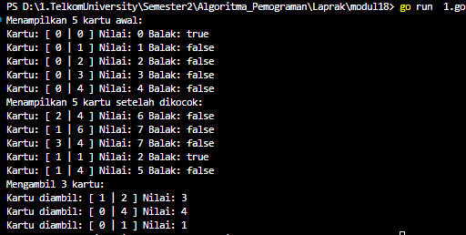
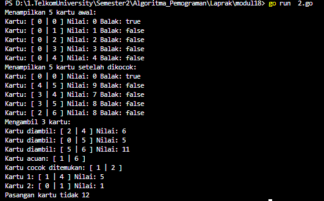
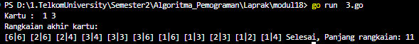
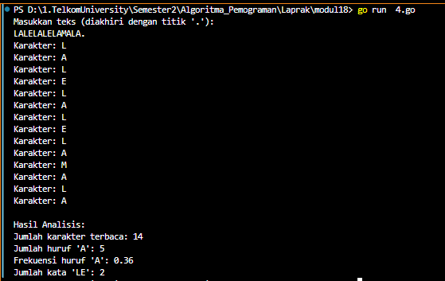

<h1 align = center > <b>  LAPORAN PRATIKUM  MODUL 17 <br>  
SKEMA PEMROSESAN SEKUENSIAL</b></h1><p align = center><b>Nama : Alvin Aldino Rahmatullah || NIM : 103112430283</b></p>

<h1>Dasar Teori</h1>
Model komputasi terdiri dari data yang dapat diolah dan operasi-operasi dasar pengolahan data tersebut. Mesin abstrak adalah model komputasi yang dirancang di atas model mesin komputasi yang telah ada, yaitu tipe data dan operasi-operasi dasarnya dibuat menggunakan tipe data dan operasi-operasi yang tersedia di mesin di bawahnya. Contoh penerapannya ada pada domino yang kartunya memiliki dua sisi bernilai 0 sampai 6 dan memiliki sistem mengocok, mengambil, dan mengevaluasi kartu, termasuk mencari kartu yang cocok dan memeriksa pasangan kartu.
<h1>Unguided </h1>
**Soal 1**
> Implementasi operasi dasar mesin domino sebagai sebuah subprogram: 
> a. Buat tipe data kartu domino (Domino) yang menyimpan informasi 
>>➢ gambar (suit) kedua sisi kartu 
>>➢ nilai kartu 
>>➢ Boolean data yang menyatakan kartu ini balak atau bukan 
>>➢ Buat tipe data satu set kartu domino (Dominoes) 
>>➢ Array menyimpan 28 kartu Domino 
>>➢ Jumlah kartu tersisa dalam array tersebut 
>b. prosedur kocokKartu(Dominoes) 
>c. fungsi ambilKartu(Dominoes) → Domino 
>d. fungsi gambarKartu(Domino,suit int) → int e) fungsi nilaiKartu(Domino) → int
>
>**-Code-**

```go
package main
import (
    "fmt"
    "math/rand"
    "time"
)
  
type Domino struct {
    suit1 int
    suit2 int
    nilai int
    balak bool
}
  
type Dominoes struct {
    kartu  [28]Domino
    jumlah int
}

func buatSetDomino() Dominoes {
    var d Dominoes
    index := 0
    for i := 0; i <= 6; i++ {
        for j := i; j <= 6; j++ {
            nilai := i + j
            balak := i == j
            d.kartu[index] = Domino{i, j, nilai, balak}
            index++
        }
    }
    d.jumlah = 28
    return d
}
  
func kocokKartu(d Dominoes) Dominoes {
    rand.Seed(time.Now().UnixNano())

    for i := 0; i < d.jumlah; i++ {
        j := rand.Intn(d.jumlah)
        d.kartu[i], d.kartu[j] = d.kartu[j], d.kartu[i]
    }
    return d
}

func ambilKartu(d Dominoes) (Dominoes, Domino) {
    if d.jumlah == 0 {
        return d, Domino{-1, -1, -1, false}
    }
    d.jumlah--
    return d, d.kartu[d.jumlah]
}

func gambarKartu(k Domino, suit int) int {
    if suit == 1 {
        return k.suit1
    }
    return k.suit2
} 

func nilaiKartu(k Domino) int {

    return k.nilai
}

func main() {
    dominoSet := buatSetDomino()
    fmt.Println("Menampilkan 5 kartu awal: ")
    for i := 0; i < 5; i++ {
        k := dominoSet.kartu[i]
        fmt.Println("Kartu:", "[", k.suit1, "|", k.suit2, "]", "Nilai:", k.nilai, "Balak:", k.balak)
    }
  
    dominoSet = kocokKartu(dominoSet)
    fmt.Println("Menampilkan 5 kartu setelah dikocok:  ")
    for i := 0; i < 5; i++ {
        k := dominoSet.kartu[i]
        fmt.Println("Kartu:", "[", k.suit1, "|", k.suit2, "]", "Nilai:", k.nilai, "Balak:", k.balak)
    }

    fmt.Println("Mengambil 3 kartu: ")
    for i := 0; i < 3; i++ {
        var kartu Domino
        dominoSet, kartu = ambilKartu(dominoSet)
        fmt.Println("Kartu diambil:", "[", kartu.suit1, "|", kartu.suit2, "]", "Nilai:", kartu.nilai)
    }
}
```

>**-Output-**
>
>
>
>**-Penjelasan Program-**
>
>Program ini adalah implementasi mesin abstrak domino yang mendefinisikan set kartu domino dan operasi fundamental berikutnya, contohnya pembuatan, pengacakkan, dan pengambil kartu. Tipe data Domino menyimpan dua sisi kartu (suit1, suit2), nilai total kartu (nilai), dan status balak (apabila kedua sisi nilainya sama). Dominoes menyimpan array containing 28 kartu yang unik dan jumlah kartu yang masih ada. Program memiliki beberapa fungsi dasar, seperti buatSetDomino untuk melakukan pembuat kartu, kocokKartu untuk mengacak, ambilKartu untuk mengambil kartu dari stock, dan gambarKartu dan nilaiKartu untuk melihat isi dan nilai kartu. Pada fungsi main, program menampilkan 5 kartu awal sebelum dan setelah dikocok, kemungkinan mengambil dan menampilkan 3 kartu dari stock. Implementasi ini sama seperti konsep mesin abstrak.


---


**Soal 2**
> Realisasi aksi berikut menggunakan operasi-operasi dasar mesin domino: 
> a. prosedur galiKartu(Dominoes,Domino) yang mengambil kartu dari tumpukan sampai diperoleh kartu dengan gambar (suit) yang sama dengan kartu yang diberikan 
> b. fungsi sepasangKartu(Domino,Domino) → boolean; yang memberikan nilai true jika total nilai kartu adalah 12 dan false jika tidak

>**-Code-**

```go
package main
import (
    "fmt"
    "math/rand"
    "time"
)

type Domino struct {
    suit1 int
    suit2 int
    nilai int
    balak bool
}
  
type Dominoes struct {
    kartu  [28]Domino
    jumlah int
}
  
func buatSetDomino() Dominoes {
    var d Dominoes
    index := 0
    for i := 0; i <= 6; i++ {
        for j := i; j <= 6; j++ {
            nilai := i + j
            balak := i == j
            d.kartu[index] = Domino{i, j, nilai, balak}
            index++
        }
    }
    d.jumlah = 28
    return d
}

func kocokKartu(d Dominoes) Dominoes {
    rand.Seed(time.Now().UnixNano())
    for i := 0; i < d.jumlah; i++ {
        j := rand.Intn(d.jumlah)
        d.kartu[i], d.kartu[j] = d.kartu[j], d.kartu[i]
    }
    return d
}

func ambilKartu(d Dominoes) (Dominoes, Domino) {
    if d.jumlah == 0 {
        return d, Domino{-1, -1, -1, false}
    }
    d.jumlah--
    return d, d.kartu[d.jumlah]
}

func gambarKartu(k Domino, sisi int) int {
    if sisi == 1 {
        return k.suit1
    }
    return k.suit2
}
  
func nilaiKartu(k Domino) int {
    return k.nilai
}
  
func galiKartu(d Dominoes, acuan Domino) (Dominoes, Domino) {
    var k Domino
    var cocok bool = false
    for !cocok && d.jumlah > 0 {
        var hasil Dominoes
        hasil, k = ambilKartu(d)
        d = hasil
        if k.suit1 == acuan.suit1 || k.suit1 == acuan.suit2 ||
            k.suit2 == acuan.suit1 || k.suit2 == acuan.suit2 {
            cocok = true
        }
    }

    if !cocok {
        k = Domino{-1, -1, -1, false}
    }
    return d, k
}

func sepasangKartu(k1 Domino, k2 Domino) bool {
    return nilaiKartu(k1)+nilaiKartu(k2) == 12
}

func main() {
    var dominoSet Dominoes = buatSetDomino()
    var kartu, kartuAcuan, kartuCocok, kartu1, kartu2 Domino
  
    fmt.Println("Menampilkan 5 kartu awal:")
    for i := 0; i < 5; i++ {
        k := dominoSet.kartu[i]
        fmt.Println("Kartu:", "[", k.suit1, "|", k.suit2, "]", "Nilai:", k.nilai, "Balak:", k.balak)
    }
    dominoSet = kocokKartu(dominoSet)

    fmt.Println("Menampilkan 5 kartu setelah dikocok:")
    for i := 0; i < 5; i++ {
        k := dominoSet.kartu[i]
        fmt.Println("Kartu:", "[", k.suit1, "|", k.suit2, "]", "Nilai:", k.nilai, "Balak:", k.balak)

    }

    fmt.Println("Mengambil 3 kartu:")
    for i := 0; i < 3; i++ {
        dominoSet, kartu = ambilKartu(dominoSet)
        fmt.Println("Kartu diambil:", "[", kartu.suit1, "|", kartu.suit2, "]", "Nilai:", kartu.nilai)
    }
    dominoSet, kartuAcuan = ambilKartu(dominoSet)
    fmt.Println("Kartu acuan:", "[", kartuAcuan.suit1, "|", kartuAcuan.suit2, "]")

    dominoSet, kartuCocok = galiKartu(dominoSet, kartuAcuan)
    if kartuCocok.nilai != -1 {
        fmt.Println("Kartu cocok ditemukan:", "[", kartuCocok.suit1, "|", kartuCocok.suit2, "]")
    } else {
        fmt.Println("Tidak ada kartu yang cocok ditemukan.")
    }
    
    dominoSet, kartu1 = ambilKartu(dominoSet)
    dominoSet, kartu2 = ambilKartu(dominoSet)
    fmt.Println("Kartu 1:", "[", kartu1.suit1, "|", kartu1.suit2, "]", "Nilai:", nilaiKartu(kartu1))
    fmt.Println("Kartu 2:", "[", kartu2.suit1, "|", kartu2.suit2, "]", "Nilai:", nilaiKartu(kartu2))

    if sepasangKartu(kartu1, kartu2) {
        fmt.Println("Pasangan kartu jumlah nilainya 12")
    } else {
        fmt.Println("Pasangan kartu tidak 12")
    }
}
```

>**-Output-**
>
>
>
>**-Penjelasan Program-**
>
> Program dimulai dengan membuat 28 kartu domino unik tanpa duplikat dengan menggunakan fungsi buatSetDomino, lalu meng kocok urutannya dengan menggunakan kocokKartu. Setiap kartu menyimpan informasi dua sisi nilai (suit1, suit2), nilai total (nilai), dan status apakah kartu termasuk balak. Selanjutnya, program menampilkan 5 kartu awal dan 5 kartu setelah dikocok dan mengambil 3 kartu dari tumpukan secara berurutan. Selain hal itu, program ini juga ditambahkan fungsi "sepasangKartu" yang berfungsi untuk mengecek apakah kedua kartu tersebut merupakan pasangan dengan jumlah 12  dan ada juga yang menggunakan satu kartu sebagai referensi dan mencari kartu lain yang memiliki satu sisi yang sama dengan kartu referensi dengan menggunakan fungsi galiKartu.


---


**Soal 3**
> Implementasi salah satu permainan domino. Lihat lampiran untuk deskripsi permainan Gapleh.

>**-Code-**

```go
package main
import (
    "fmt"
    "math/rand"
    "time"
)
  
type Domino struct {
    suit1 int
    suit2 int
    nilai int
    balak bool
}
  
type Dominoes struct {
    kartu  [28]Domino
    jumlah int
}

func buatSetDomino() Dominoes {
    var d Dominoes
    indeks := 0
    for i := 0; i <= 6; i++ {
        for j := i; j <= 6; j++ {
            var nilai int = i + j
            var balak bool = i == j
            d.kartu[indeks] = Domino{i, j, nilai, balak}
            indeks++
        }
    }
    d.jumlah = 28
    return d
}

func kocokKartu(d Dominoes) Dominoes {
    rand.Seed(time.Now().UnixNano())
    for i := 0; i < d.jumlah; i++ {
        acak := rand.Intn(d.jumlah)
        d.kartu[i], d.kartu[acak] = d.kartu[acak], d.kartu[i]
    }
    return d
}

func ambilKartu(d Dominoes) (Dominoes, Domino) {
    if d.jumlah == 0 {
        var kosong Domino = Domino{-1, -1, -1, false}
        return d, kosong
    }
    var kartu Domino = d.kartu[d.jumlah-1]
    d.jumlah = d.jumlah - 1
    return d, kartu
}

func main() {
    var dominoSet Dominoes = buatSetDomino()
    dominoSet = kocokKartu(dominoSet)

    var rangkaian [28]Domino
    var panjang int

    var hasilAmbil Dominoes
    var kartu, kartuAwal Domino

    hasilAmbil, kartuAwal = ambilKartu(dominoSet)
    dominoSet = hasilAmbil
  
    rangkaian[0] = kartuAwal
    panjang = 1

    fmt.Println("Kartu : ", kartuAwal.suit1, kartuAwal.suit2)
    var kiri int = kartuAwal.suit1
    var kanan int = kartuAwal.suit2

    for dominoSet.jumlah > 0 {
        var hasil Dominoes
        hasil, kartu = ambilKartu(dominoSet)
        dominoSet = hasil
  
        if kartu.suit1 == kiri {
            kiri = kartu.suit2
            for i := panjang; i > 0; i-- {
                rangkaian[i] = rangkaian[i-1]
            }
            rangkaian[0] = kartu
            panjang = panjang + 1
        } else if kartu.suit2 == kiri {
            kiri = kartu.suit1
            for i := panjang; i > 0; i-- {
                rangkaian[i] = rangkaian[i-1]
            }
            rangkaian[0] = kartu
            panjang = panjang + 1
        } else if kartu.suit1 == kanan {
            kanan = kartu.suit2
            rangkaian[panjang] = kartu
            panjang = panjang + 1
        } else if kartu.suit2 == kanan {
            kanan = kartu.suit1
            rangkaian[panjang] = kartu
            panjang = panjang + 1
        }
    }
  
    fmt.Println("Rangkaian akhir kartu:")
    for i := 0; i < panjang; i++ {
        var k Domino = rangkaian[i]

        fmt.Print("[", k.suit1, "|", k.suit2, "] ")
    }
    fmt.Println("Selesai, Panjang rangkaian:", panjang)
}
```

>**-Output-**
>
>
>
>**-Penjelasan Program-**
>
>Program ini adalah simulasi permainan Gapleh dengan yang memiliki konsep hampir sama dengan domino. kartu domino yang ada dalam struktur Domino yang menyimpan dua sisinya pada kartu (suit1, suit2), nilai total (nilai), dan apakah kartu adalah balak. Struktur Dominoes menyimpan satu set kartu sebanyak kartu 28 unik dan jumlah kartu yang tersisa. Setelah membuat dan mencampur seluruh kartu, program mengambil satu kartu sebagai kartu awal dan melakukan rangkaian permainan. Selanjutnya, program secara otomatis mengambil kartu dan menyusun dari kiri ke kanan dan menghitung panjang rangkaian. 


---


**Soal 4**
> Implementasi mesin abstrak karakter yang bekerja terhadap untaian karakter (yang diakhiri dengan penanda titik (".") dan mempunyai sejumlah operasi dasar. 
> a. Operasi dasar mesin karakter: 
> >➢ Prosedur start(); yang menyiapkan mesin karakter di awal rangkaian karakter. 
> >➢ Prosedur maju(); yang memajukan pembaca ke posisi karakter berikutnya. 
> >➢ Fungsi eop(); yang mengembalikan nilai true apabila sudah mencapai akhir rangkaian, sampai ke penanda titik ("."). 
> >➢ Fungsi cc(); yang mengembalikan karakter yang sedang terbaca, atau berada pada posisi pembacaan mesin. 
> b. Dengan operasi dasar di atas buat algoritma untuk: 
> >➢ Membaca seluruh karakter yang diberikan ke mesin karakter tersebut. 
> >➢ Menghitung berapa banyak karakter yang terbaca. 
> >➢ Menghitung ada berapa huruf "A" yang terbaca. 
> >➢ Menghitung frekuensi kemunculan huruf "A" terhadap seluruh karakter terbaca. 
> >➢ Menghitung ada berapa kata "LE" (pasangan berturutan huruf "L" dan "E") yang terbaca.

>**-Code-**

```go
package main
import "fmt"
  
type MesinKarakter struct {
    input    string
    posisi   int
    karakter byte
}
  
func start(m MesinKarakter) MesinKarakter {
    m.posisi = 0
    m.karakter = m.input[m.posisi]
    return m
}
  
func maju(m MesinKarakter) MesinKarakter {
    m.posisi = m.posisi + 1
    if m.posisi < len(m.input) {
        m.karakter = m.input[m.posisi]
    } else {
        m.karakter = '.'
    }
    return m
} 

func eop(m MesinKarakter) bool {
    return m.karakter == '.'
}
  
func cc(m MesinKarakter) byte {
    return m.karakter
}

func main() {
    var teks string
    var jumlahKarakter, jumlahA, jumlahLE int
    var sebelumnya byte
    var frekuensiA float64
  
    fmt.Println("Masukkan teks : ")
    fmt.Scanln(&teks)

    if teks[len(teks)-1] != '.' {
        teks = teks + "."
    }

    var mesin MesinKarakter = MesinKarakter{input: teks}
    mesin = start(mesin)

    for !eop(mesin) {
        var karakterSekarang byte = cc(mesin)
        fmt.Println("Karakter:", string(karakterSekarang))
        jumlahKarakter = jumlahKarakter + 1
        if karakterSekarang == 'A' {
            jumlahA = jumlahA + 1
        }
        if sebelumnya == 'L' && karakterSekarang == 'E' {
            jumlahLE = jumlahLE + 1
        }
        sebelumnya = karakterSekarang
        mesin = maju(mesin)
    }

    if jumlahKarakter > 0 {

        frekuensiA = float64(jumlahA) / float64(jumlahKarakter)

    }

    fmt.Println("Hasil Analisis:")
    fmt.Println("Jumlah karakter terbaca:", jumlahKarakter)
    fmt.Println("Jumlah huruf 'A':", jumlahA)
    fmt.Printf("Frekuensi huruf 'A': %.2f\n", frekuensiA)
    fmt.Println("Jumlah kata 'LE':", jumlahLE)
}
```

>**-Output-**
>
>
>
>**-Penjelasan Program-**
>Program ini seperti sebuah untuaian karakter yang di input user . Untaian karakter tersebut dianalisis secara satu per satu dengan menggunakan struktur  "MesinKarakter", yang menyimpan teks input, posisi karakter saat ini, dan karakter yang sedang dibaca. Program dimulai dengan memanggil prosedur "start", lalu membaca karakter satu per satu dengan "maju", dan terus berjalan selama belum mencapai tanda akhir titik (`.`) yang berfungsi sebagai penanda akhir (EOP). Selama pembacaan, program mencatat jumlah seluruh karakter yang terbaca, menghitung berapa banyak kemunculan  'A' dan "LE". Setelah proses selesai, program menghitung frekuensi huruf 'A' terhadap total karakter.


---
