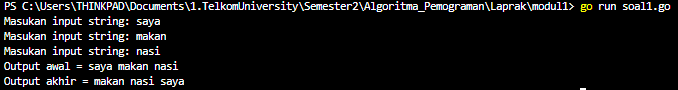
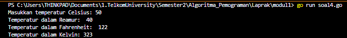
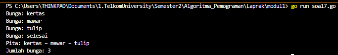
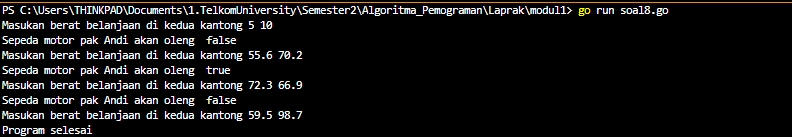
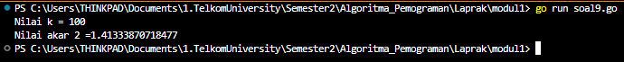
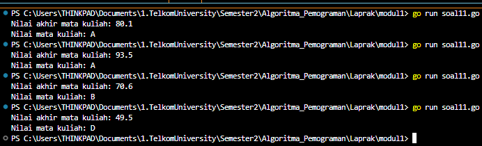

---

---
----
<h1 align = center > <b>  LAPORAN PRATIKUM  MODUL  2 <br>  
REVIEW PENGENALAN PEMROGRAMAN </b></h1><p align = center><b>Nama : Alvin Aldino Rahmatullah || NIM : 103112430283</b></p>

<h1>Dasar Teori</h1>
Go atau Golang diciptakan oleh Google yang dipelopori oleh Robert Griesemer, Rob Pike, dan Ken Thompson dan diumumkan kepada publik pada bulan November 2009. Bahasa pemrograman ini dirancang dengan tujuan untuk menjadi efisien dalam proses kompilasi dan eksekusi, serta efektif dalam menulis program yang dapat diandalkan . Dalam pengembangannya, Go menghindari fitur yang memperumit kode dan tidak dapat efisien, seperti halnya bahasa pemrograman C, sehingga Go dapat menghasilkan output yang optimal dengan waktu minimal. Fitur yang diandalkan dalam bahasa pemrograman ini antara lain konkurensi yang efisien dan pendekatan yang sangat 
fleksibel terhadap abstraksi data dan pemrograman berorientasi objek.
<h1>Unguided </h1>
<p><b> Latihan Modul 2A</b></p>
<b>Soal 1 </b>
>Telusuri program berikut dengan cara mengkompilasi dan mengeksekusi program. Silakan masukan data yang sesuai sebanyak yang diminta program. Perhatikan keluaran yang diperoleh. Coba terangkan apa sebenarnya yang dilakukan program tersebut?

```go
package main
import "fmt"

func main() {
    var (
        satu, dua, tiga string
        temp string
    )

    fmt.Print("Masukan input string: ")
    fmt.Scanln(&satu)

    fmt.Print("Masukan input string: ")
    fmt.Scanln(&dua)

    fmt.Print("Masukan input string: ")
    fmt.Scanln(&tiga)

    fmt.Println("Output awal = " + satu + " " + dua + " " + tiga)
    temp = satu
    satu = dua
    dua = tiga
    tiga = temp
    fmt.Println("Output akhir = " + satu + " " + dua + " " + tiga)
}
```

-Output-
> 
>Program akan meminta user untuk input 3 kata untuk di simpan pada masing masing variabel string contohnya "satu" akan menyimpan kata pertama dan begitu seterusnya, sampai ketika program mengeluarkan "output awal" maka seluruh kata yang di masukkan user akan keluar secara berurutan, namun berbeda dengan "output akhir" program akan menampilkan kata awal yang tidak berurutan seperti di awal, hal ini bisa terjadi karena adanya program yang merubah posisi seperti variabel satu akan menjadi input 2, variabel dua akan menjadi imput 3 dan variabel tiga akan menjadi input 1.

<b>Soal 2</b>
>Tahun kabisat adalah tahun yang habis dibagi 400 atau habis dibagi 4 tetapi tidak habis dibagi 100. Buatlah sebuah program yang menerima input sebuah bilangan bulat dan memeriksa apakah bilangan tersebut merupakan tahun kabisat (true) atau bukan (false).

```go
package main
import "fmt"

func main() {
    var tahun int
    var kabisat bool

    fmt.Print("Masukkan tahun: ")
    fmt.Scan(&tahun)
  
    kabisat = (tahun % 400 == 0) || (tahun % 4 == 0 && tahun % 100 != 0)
    fmt.Println("kabisat: ", kabisat)
}
```

-Output-
> 
> Program bertujuan untuk mengetahui apakah tahun yang di input user termasuk tahun kabisat atau bukan. Program ini sangat sederhana yaitu memakai konsep modulo (sisa bagi) yakni apakah tahun (input user) akan nol jika di modulo dengan 400 dan jika input user di modulo 100 tidak menghasilkan nol maka output yang keluar true, jika tidak maka hasilnya akan false.

<b>Soal 3</b>
>Buat program Bola yang menerima input jari-jari suatu bola (bilangan bulat). Tampilkan Volume dan Luas kulit bola. 𝑣𝑜𝑙𝑢𝑚𝑒𝑏𝑜𝑙𝑎 = 4/3 𝜋𝑟3 dan 𝑙𝑢𝑎𝑠𝑏𝑜𝑙𝑎 = 4 𝜋𝑟2 (π ≈ 3.1415926535).

``` go
package main
import "fmt"

func main() {
    var r float64
    const pi = 3.1415926535

    fmt.Print("Jarijari: ")
    fmt.Scan(&r)

    volume := (4.0 / 3.0) * pi * (r * r * r)
    luasPermukaan := 4 * pi * (r * r)

    fmt.Printf("Volume %.4f bola dan luas kulit %.4f\n", volume, luasPermukaan)
}
```

-Output-
> 
> Program akan menghitung volume dan luas kulit bola dengan input dari user dengan perhitungan yang telah di berikan pada soal pada program kali ini memakai tipe data float karena output yang di inginkan memiliki angka di belakang koma.

<b>Soal 4</b>
>Dibaca nilai temperatur dalam derajat Celsius. Nyatakan temperatur tersebut dalam Fahrenheit 𝐶𝑒𝑙𝑠𝑖𝑢𝑠 = (𝐹𝑎ℎ𝑟𝑒𝑛ℎ𝑒𝑖𝑡 − 32) × 5/9 𝑅𝑒𝑎𝑚𝑢𝑟 = 𝐶𝑒𝑙𝑐𝑖𝑢𝑠 × 4/5 𝐾𝑒𝑙𝑣𝑖𝑛 = (𝐹𝑎ℎ𝑟𝑒𝑛ℎ𝑒𝑖𝑡 + 459.67) × 5/9

```go
package main
import "fmt"

func main() {
    var celsius float64
    
    fmt.Print("Masukkan temperatur Celsius: ")
    fmt.Scan(&celsius)

    fahrenheit := (celsius * 9 / 5) + 32
    reamur := celsius * 4 / 5
    kelvin := (fahrenheit + 459.67) * 5 / 9

    fmt.Println("Temperatur dalam Reamur: ", reamur)
    fmt.Println("Temperatur dalam Fahrenheit: ", fahrenheit)
    fmt.Printf("Temperatur dalam Kelvin: %.0f\n", kelvin)
}
```

-Output-
>
>Program akan menghitung masing masing temperatur celcius yang di masukkan user ke dalam program, namun soal tidak memjelaskan rumus untuk mencari fahrenheit maka dari itu dalam program di tambahkan rumusnya yaitu  fahrenheit := (celsius * 9 / 5) + 32. 

<b>Soal 5</b>
>Tipe karakter sebenarnya hanya apa yang tampak dalam tampilan. Di dalamnya tersimpan dalam bentuk biner 8 bit (byte) atau 32 bit (rune) saja. Buat program ASCII yang akan membaca 5 buat data integer dan mencetaknya dalam format karakter. Kemudian membaca 3 buah data karakter dan mencetak 3 buah karakter setelah karakter tersebut (menurut tabel ASCII) Masukan terdiri dari dua baris. Baris pertama berisi 5 buah data integer. Data integer mempunyai nilai antara 32 s.d. 127. Baris kedua berisi 3 buah karakter yang berdampingan satu dengan yang lain (tanpa dipisahkan spasi). Keluaran juga terdiri dari dua baris. Baris pertama berisi 5 buah representasi karakter dari data yang diberikan, yang berdampingan satu dengan lain, tanpa dipisahkan spasi. Baris kedua berisi 3 buah karakter (juga tidak dipisahkan oleh spasi).

``` go
package main
import "fmt"
  
func main() {
    var angka1, angka2, angka3, angka4, angka5 int
    var huruf1, huruf2, huruf3 rune

    fmt.Scan(&angka1, &angka2, &angka3, &angka4, &angka5)
    fmt.Scanln()
    fmt.Scanf("%c%c%c\n", &huruf1, &huruf2, &huruf3)
  
    huruf1 += 1
    huruf2 += 1
    huruf3 += 1
  
    fmt.Printf("%c%c%c%c%c\n", angka1, angka2, angka3, angka4, angka5)
    fmt.Printf("%c%c%c\n", huruf1, huruf2, huruf3)
}
```

-Output-
>
> Program ini digunakan untuk membaca lima bilangan bulat dan 3 karakter huruf yang di input oleh user. lima bilangan bulat tersebut akan di ubah menjadi huruf sehingga dapat menyusun sebuah kata tanpa spasi begitu juga dengan 3 karakter huruf. Program ini memanfaatkan tipe data rune untuk menangani karakter dan operasi aritmetika sederhana untuk menggeser nilai ASCII.

<p><b> Latihan Modul 2B</b></p>
<b>Soal 1</b>
>Siswa kelas IPA di salah satu sekolah menengah atas di Indonesia sedang mengadakan praktikum kimia. Di setiap percobaan akan menggunakan 4 tabung reaksi, yang mana susunan warna cairan di setiap tabung akan menentukan hasil percobaan. Siswa diminta untuk mencatat hasil percobaan tersebut. Percobaan dikatakan berhasil apabila susunan warna zat cair pada gelas 1 hingga gelas 4 secara berturutan adalah ‘merah’, ‘kuning’, ‘hijau’, dan ‘ungu’ selama 5 kali percobaan berulang. Buatlah sebuah program yang menerima input berupa warna dari ke 4 gelas reaksi sebanyak 5 kali percobaan. Kemudian program akan menampilkan true apabila urutan warna sesuai dengan informasi yang diberikan pada paragraf sebelumnya, dan false untuk urutan warna lainnya.

```go
package main
import "fmt"
  
func main() {
    var warna1, warna2, warna3, warna4 string

    berhasil := true

    for i := 1; i <= 5; i++ {
        fmt.Print(" Percobaan ", i, " : ")
        fmt.Scan(&warna1, &warna2, &warna3, &warna4)

        if !(warna1 == "merah" && warna2 == "kuning" && warna3 == "hijau" && warna4 == "ungu") {

            berhasil = false
        }
    }
    fmt.Println("Berhasil:", berhasil)
}
```

-Output-
>
>Program akan menganalisa apakah input dari user selalu sama dengan urutan yang ada di soal, program akan mengecek apakah setiap perulangan selalu sama.  Jika program membaca warna merah, kuning, hijau dan ungu secara berurutan secara terus menerus maka output yang di hasilkan adalah true karna dari awal nilai dari "berhasil" adalah true dan jika warna berurutan atau ada yang tidak sesuai, maka akan false.

<b>Soal 2</b>
Suatu pita (string) berisi kumpulan nama-nama bunga yang dipisahkan oleh spasi dan ‘ ‘, contoh pita diilustrasikan seperti berikut ini. Pita: mawar – melati – tulip – teratai – kamboja – anggrek Buatlah sebuah program yang menerima input sebuah bilangan bulat positif (dan tidak nol) N, kemudian program akan meminta input berupa nama bunga secara berulang sebanyak N kali dan nama tersebut disimpan ke dalam pita. Modifikasi program sebelumnya, proses input akan berhenti apabila user mengetikkan ‘selesai’. Kemudian tampilkan isi pita beserta banyaknya bunga yang ada di dalam pita Perhatikan contoh sesi interaksi program seperti di bawah ini. 

```go
package main
import "fmt"
  
func main() {
    var bunga, pita string
    var jumlahBunga int

    for {
        fmt.Print("Bunga: ")
        fmt.Scan(&bunga)

        if bunga == "selesai" {
            break
        }

        if jumlahBunga > 0 {
            pita += " – " + bunga
        } else {
            pita += bunga
        }
        jumlahBunga++
    }

    fmt.Println("Pita:", pita)
    fmt.Println("Jumlah bunga:", jumlahBunga)
}
```

-Output-
> 
> Program ini adalah versi yang telah di modifikasi yakni ketika ingin menghentikan perulangan maka user harus mengetik "selesai" hal ini memakai konsep while-loop yakni ketika program menerima perintah untuk break maka program secara otomatis akan berhenti jika tidak maka program akan terus meminta dan akan di hitung ke dalam variabel "jumlah bunga" terus menerus sampai user merasa cukup.

<b>Soal 3</b>
Setiap hari Pak Andi membawa banyak barang belanjaan dari pasar dengan mengendarai sepeda motor. Barang belanjaan tersebut dibawa dalam kantong terpal di kiri-kanan motor. Sepeda motor tidak akan oleng jika selisih berat barang di kedua kantong sisi tidak lebih dari 9 kg. Buatlah program Pak Andi yang menerima input dua buah bilangan real positif yang menyatakan berat total masing-masing isi kantong terpal. Program akan terus meminta input bilangan tersebut hingga salah satu kantong terpal berisi 9 kg atau lebih. 

```go
package main
import "fmt"

func main() {
    var kiri, kanan, berat float64
    var total = false
    for berat < 150 {

        fmt.Printf("Masukan berat belanjaan di kedua kantong ")
        fmt.Scanln(&kiri, &kanan)
        
        selisih := kiri - kanan
        if selisih < 0 {
            selisih = -selisih
        }

        total = selisih >= 9
        berat = kiri + kanan
        if berat < 150 {
            fmt.Println("Sepeda motor pak Andi akan oleng ", total)
        }
    }
    fmt.Println("Program selesai")
}
```

-Output-
>
>Program akan memprediksi apakah berat dari motor pak andi telah mencapai maksimul, jika ya maka program akan otomatis berhenti, namun jika tidak maka program akan meminta jumlah berat kantong dari pak andi. program ini memkai looping untuk meminta user memasukkan jumlah berat secara terus menerus sampai target di penuhi dan memakai if untuk mengetahui apakah berat nya true atau false.

<b>Soal 4</b>
>Diberikan sebuah persamaan sebagai berikut ini. f(𝑘) = (4𝑘 +2)^2 / (4𝑘 +1)(4𝑘 +3) Buatlah sebuah program yang menerima input sebuah bilangan sebagai K, kemudian menghitung dan menampilkan nilai f(K) sesuai persamaan di atas. √2 merupakan bilangan irasional. Meskipun demikian, nilai tersebut dapat dihampiri dengan rumus berikut:√2 =∏ (4𝑘+2)2 𝑘=0 (4𝑘 +1)(4𝑘 +3). Modifikasi program sebelumnya yang menerima input integer 𝐾 dan menghitung √2 untuk 𝐾 tersebut. Hampiran √2 dituliskan dalam ketelitian 10 angka di belakang koma.

``` go
package main

import (
    "fmt"
    "math"
)

func main() {
    var k int
  
    fmt.Print("Nilai k = ")
    fmt.Scan(&k)

    result := 1.0
    for i := 0; i <= k; i++ {
        numerator := math.Pow(float64(4*i+2), 2)
        denumerator := float64((4*i + 1) * (4*i + 3))
        result *= numerator / denumerator
    }
    fmt.Print("Nilai akar 2 = ", result)
}
```

>
> Program ini menjalankan perhitungan matematika seperti pada soal. Program meminta pengguna untuk memasukkan nilai KKK sebagai input. Kemudian, program akan menghitung sesuai rumus dan menampilkan hasilnya, program ini menggunakan loop agar mudah menghitung hal tersebut secara ber ulang ulang

<p><b> Latihan Modul 2C</b></p>
<b>Soal 1</b>
>PT POS membutuhkan aplikasi perhitungan biaya kirim berdasarkan berat parsel. Maka, buatlah program BiayaPos untuk menghitung biaya pengiriman tersebut dengan ketentuan sebagai berikut! Dari berat parsel (dalam gram), harus dihitung total berat dalam kg dan sisanya (dalam gram). Biaya jasa pengiriman adalah Rp. 10.000,- per kg. Jika sisa berat tidak kurang dari 500 gram, maka tambahan biaya kirim hanya Rp. 5,- per gram saja. Tetapi jika kurang dari 500 gram, maka tambahan biaya akan dibebankan sebesar Rp. 15,- per gram. Sisa berat (yang kurang dari 1kg) digratiskan biayanya apabila total berat ternyata lebih dari 10kg.

``` go
package main
import "fmt"

func main() {
    var berat int
    fmt.Print("Masukkan berat parsel (gram): ")
    fmt.Scanln(&berat)
  
    kg, gram := berat/1000, berat%1000
    biaya := kg * 10000
    tambahan := 0

    if kg < 10 {
        if gram < 500 {
            tambahan = gram * 15
        } else {
            tambahan = gram * 5
        }
    }

    fmt.Println("Berat parsel:", berat, "gram")
    fmt.Println("Total berat:", kg, "kg", gram, "gram")
    fmt.Println("Detail biaya: Rp.", biaya, "+ Rp.", tambahan)
    fmt.Println("Total biaya: Rp", biaya+tambahan)
 }
}```

-Output-
>
> Program berguna untuk menghitung biaya pengiriman parsel  berdasarkan berat dari user dalam satuan gram. program ini sangat mempermudah dalam menghitung total berat dan biaya sehingga tidak perlu menghitung secara manual dan program ini menggunakan If untuk melaksanakan program dan di bantu dengan hitung hitungan se
<b>Soal 2</b>
>Program berikut menerima input sebuah bilangan riil yang menyatakan NAM. Program menghitung NMK dan menampilkannya. Jawablah pertanyaan-pertanyaan berikut: 
a. Jika nam diberikan adalah 80.1, apa keluaran dari program tersebut? Apakah eksekusi program tersebut sesuai spesifikasi soal? 
b. Apa saja kesalahan dari program tersebut? Mengapa demikian? Jelaskan alur program seharusnya! 
c. Perbaiki program tersebut! Ujilah dengan masukan: 93.5; 70.6; dan 49.5. Seharusnya keluaran yang diperoleh adalah ‘A’, ‘B’, dan ‘D’.

```go
package main
import "fmt"

func main() {
    var nam float64
    var nmk string
  
    fmt.Print("Nilai akhir mata kuliah: ")
    fmt.Scanln(&nam)

    if nam > 80 {
        nmk = "A"
    } else if nam > 72.5 && nam <= 80 {
        nmk = "AB"
    } else if nam > 65 && nam <= 72.5 {
        nmk = "B"
    } else if nam > 57.5 && nam <= 65 {
        nmk = "BC"
    } else if nam > 50 && nam <= 57.5 {
        nmk = "C"
    } else if nam > 40 && nam <= 50 {
        nmk = "D"
    } else if nam <= 40 {
        nmk = "E"
    }
    fmt.Println("Nilai mata kuliah:", nmk)

}
```

-Output-
>
>Pertanyaan :
> A. Pada saat di run dengan kode awal yang sebelum di perbaiki output dari program tidak sesuai kriteria yang di inginkan karena terjadi error yang di sebabkan salahnya penaruhan variabel yang seharusnya nmk dan berbagai kesalahan lain. namun setelah di perbaiki hasil dari output sangat sesuai dengan spesifikasi soal.
> B. Kesalahan yang pertama yang saya lihat adalah nama variabel yang salah yang seharusnya nmk untuk memenuhi tipe data string dan ada juga bagian if yang seharunya baris ke dua yang di isi oleh else if, serta menambahkan nilai maksimum dan minimum untuk para mahasiswa. 
> C. Kesalahan yang terjadi telah di perbaiki dan hasil output sangat sesuai dengan soal yang dapat di lihat dari screenshoot output

<b>Soal 3</b>
   >Sebuah bilangan bulat b memiliki faktor bilangan f > 0 jika f habis membagi b. Contoh: 2 merupakan faktor dari bilangan 6 karena 6 habis dibagi 2. Buatlah program yang menerima input sebuah bilangan bulat b dan b > 1. Program harus dapat mencari dan menampilkan semua faktor dari bilangan tersebut. Bilangan bulat b > 0 merupakan bilangan prima p jika dan hanya jika memiliki persis dua faktor bilangan saja, yaitu 1 dan dirinya sendiri. Lanjutkan program sebelumnya. Setelah menerima masukan sebuah bilangan bulat b > 0. Program tersebut mencari dan menampilkan semua faktor bilangan tersebut. Kemudian, program menentukan apakah b merupakan bilangan prima.
   
``` go
package main
import "fmt"
  
func main() {
    var b int
    
    fmt.Print("Bilangan : ")
    fmt.Scan(&b)

    fmt.Print("Faktor : ")
    prima := b > 1

    for i := 1; i <= b; i++ {
        if b%i == 0 {
            fmt.Print( i, " " )
            if i != 1 && i != b {
                prima = false
            }
        }
    }
    fmt.Println(" ")
    fmt.Print( prima )

}
```
   
   -Output-
   >
   >Program ini di gunakan untuk menentukan faktor faktor dari bilangan yang dimasukkan user, lalu program akan cek apakah bilangan tersebut prima atau tidak. Program ini memakai metode perulangan untuk mencari faktor faktor dari bilangan tersebut.