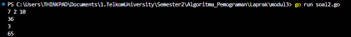
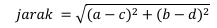
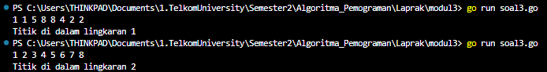

<h1 align = center > <b>  LAPORAN PRATIKUM  MODUL  3<br>  
REVIEW PENGENALAN PEMROGRAMAN </b></h1><p align = center><b>Nama : Alvin Aldino Rahmatullah || NIM : 103112430283</b></p>

<h1>Dasar Teori</h1>
Fungsi merupakan satu kesatuan rangkaian instruksi yang memberikan atau menghasilkan suatu nilai dan biasanya memetakkan input ke suatu nilai yang lain. Oleh karena itu, fungsi selalu menghasilkan/mengembalikan nilai. Suatu subprogram dikatakan fungsi apabila:
1. Ada deklarasi tipe nilai yang dikembalikan
2. Terdapat kata kunci return dalam badan subprogram. Maka fungsi digunakan jika suatu nilai biasanya diperlukan,
seperti: 
- Assignment nilai ke suatu variabel 
- Bagian dari ekspresi 
- Bagian dari argumen suatu subprogram
Karena itu selalu pilih nama fungsi yang menggambarkan nilai, seperti kata benda dan kata sifat. Contoh nama-nama fungsi: median, rerata, nilaiTerbesar, ketemu, selesai.

<h1>Unguided </h1>

<b>Soal 1 </b>
>Minggu ini, mahasiswa Fakultas Informatika mendapatkan tugas dari mata kuliah matematika diskrit untuk mempelajari kombinasi dan permutasi. Jonas salah seorang mahasiswa, iseng untuk mengimplementasikannya ke dalam suatu program. Oleh karena itu bersediakah kalian membantu Jonas? 
>  - <b>Masukkan :</b> terdiri dari empat buah bilangan asli 𝑎, 𝑏, 𝑐, dan 𝑑 yang dipisahkan oleh spasi, dengan syarat 𝑎 ≥ 𝑐 dan 𝑏 ≥ 𝑑.
>  - <b>Keluaran : </b> terdiri dari dua baris. Baris pertama adalah hasil permutasi dan kombinasi 𝒂 terhadap 𝑐, sedangkan baris kedua adalah hasil permutasi dan kombinasi 𝑏 terhadap 𝑑.
>   - <b>Catatan : </b> permutasi (P) dan kombinasi (C) dari 𝑛 terhadap 𝑟 (𝑛 ≥ 𝑟) dapat dihitung dengan menggunakan persamaan berikut!
>   

```go 
package main
import "fmt"

func faktorial(n int) int {
    if n == 0 {
        return 1
    }
    return n * faktorial(n-1)
}

func permutasi(n, r int) int {
    return faktorial(n) / faktorial(n-r)
}

func kombinasi(n, r int) int {
    return faktorial(n) / (faktorial(r) * faktorial(n-r))
}
  
func main() {
    var a, b, c, d int
    fmt.Scan(&a, &b, &c, &d)
    if a >= c && b >= d {
        fmt.Println(permutasi(a, c), kombinasi(a, c))
        fmt.Println(permutasi(b, d), kombinasi(b, d))
    } else {
        fmt.Println("Masukkan angka yang lebih kecil dari angka pertama dan kedua")
    }
}
```

-Output-
> 
 
 >Program ini saya buat untuk membantu jonas menghitung dengan syarat 𝑎 ≥ 𝑐 dan 𝑏 ≥ 𝑑  jika tidak maka akan menampilkan output "Masukkan angka yang lebih kecil dari angka pertama dan kedua".  Karena soal meminta permutasi dan kombinasi tentu kita membutuhkan faktorial, pada program ini membuat faktorial menggunakan looping seperti di bawah ini :
``` go
func faktorial(n int) int {
    if n == 0 {
        return 1
    }
    return n * faktorial(n-1)
}
```
> Lalu karena di soal telah memberi tau cara untuk membuat permutasi dan kombinasi jadi hanya perlu mengimplementasikan rumus tersebut menjadi code, seperti ini :
```go
func permutasi(n, r int) int {
    return faktorial(n) / faktorial(n-r)
}

func kombinasi(n, r int) int {
    return faktorial(n) / (faktorial(r) * faktorial(n-r))
}
```

<b>Soal 2</b>
> Diberikan tiga buah fungsi matematika yaitu 𝑓 (𝑥) = 𝑥2 , 𝑔 (𝑥) = 𝑥 − 2 dan ℎ (𝑥) = 𝑥 + 1. Fungsi komposisi (𝑓𝑜𝑔𝑜ℎ)(𝑥) artinya adalah 𝑓(𝑔(ℎ(𝑥))). Tuliskan 𝑓(𝑥), 𝑔(𝑥) dan ℎ(𝑥) dalam bentuk function. 
> - <b>Masukan </b> terdiri dari sebuah bilangan bulat 𝑎, 𝑏 dan 𝑐 yang dipisahkan oleh spasi. 
> - <b>Keluaran </b> terdiri dari tiga baris. Baris pertama adalah (𝑓𝑜𝑔𝑜ℎ)(𝑎), baris kedua (𝑔𝑜ℎ𝑜𝑓)(𝑏), dan baris ketiga adalah (ℎ𝑜𝑓𝑜𝑔)(𝑐)!

``` go
package main
import "fmt"
  
func f(x int) int {
    return x * x
}
  
func g(x int) int {
    return x - 2
}

func h(x int) int {
    return x + 1
}

func main() {
    var x, y, z int
    fmt.Scan(&x, &y, &z)
    fmt.Println(f(g(h(x))))
    fmt.Println(g(h(f(y))))
    fmt.Println(h(f(g(z))))
}
```

-Output-
>

>Ada tiga fungsi matematika yang telah di berikan yaitu 𝑓 (𝑥) = 𝑥2 , 𝑔 (𝑥) = 𝑥 − 2 dan ℎ (𝑥) = 𝑥 + 1, berarti hanya perlu merubahnya menjadi code program yang masing masing huruf memiliki func yang berbeda seperti ini
``` go
func f(x int) int {
    return x * x
}
  
func g(x int) int {
    return x - 2
}

func h(x int) int {
    return x + 1
}
```
>lalu tiga fungsi komposisi akan keluar sebagai tiga baris output.

<b>Soal 3</b>
> Suatu lingkaran didefinisikan dengan koordinat titik pusat (𝑐𝑥,𝑐𝑦) dengan radius r. Apabila diberikan dua buah lingkaran, maka tentukan posisi sebuah titik sembarang (𝑥,𝑦) berdasarkan dua lingkaran tersebut.
> - <b>Masukan </b> terdiri dari beberapa tiga baris. Baris pertama dan kedua adalah koordinat titik pusat dan radius dari lingkaran 1 dan lingkaran 2, sedangkan baris ketiga adalah koordinat titik sembarang. Asumsi sumbu x dan y dari semua titik dan juga radius direpresentasikan dengan bilangan bulat.
> - <b>Keluaran </b> berupa string yang menyatakan posisi titik "Titik di dalam lingkaran 1 dan 2", "Titik di dalam lingkaran 1", "Titik di dalam lingkaran 2", atau "Titik di luar lingkaran 1 dan 2".
> 
> Fungsi untuk menghitung jarak titik (a, b) dan (c, d) dimana rumus jarak adalah:
> 
> - <b>Catatan : </b> Lihat paket math dalam lampiran untuk menggunakan fungsi math.Sqrt() untuk menghitung akar kuadrat.

``` go
package main

import (
    "fmt"
    "math"
)

func jarak(a, b, c, d float64) float64 {
    return math.Sqrt((a-c)*(a-c) + (b-d)*(b-d))
}
  
func didalam(cx, cy, r, x, y float64) bool {
    return jarak(cx, cy, x, y) <= r
}

func main() {
    var cx1, cy1, r1, cx2, cy2, r2, x, y float64
    fmt.Scan(&cx1, &cy1, &r1, &cx2, &cy2, &r2, &x, &y)
    inside1 := didalam(cx1, cy1, r1, x, y)
    inside2 := didalam(cx2, cy2, r2, x, y)

    if inside1 && inside2 {
        fmt.Println("Titik di dalam lingkaran 1 dan 2")
    } else if inside1 {
        fmt.Println("Titik di dalam lingkaran 1")
    } else if inside2 {
        fmt.Println("Titik di dalam lingkaran 2")
    } else {
        fmt.Println("Titik di luar lingkaran 1 dan 2")
    }
}
```

-Output-
 >

>Program yang berguna untuk menghitung jarak ini memiliki 3 fungsi utama di dalam programnya yaitu 
1. Fungsi jarak berguna untuk menghitung jarak menggunakan rumus yang telah ditulis dalam soal dan mengubahnya menjadi code seperti ini
```go
   func jarak(a, b, c, d float64) float64 {
    return math.Sqrt((a-c)*(a-c) + (b-d)*(b-d))
}
```
2.  fungsi didalam yang beguna untuk memeriksa apakah titik (x,y) berada di dalam lingkaran yang memiliki pusat (cx,cy) dan jari-jari r dengan syarat jarak(cx, cy, x, y)≤r, dan jika jarak kurang atau sama dengan jari jari maka fungsi mengeluarkan true, namun jika tidak maka false
3. Fungsi main selain berguna untuk input, juga berguna juga untuk memeriksa apakah inside 1 dan inside 2 (send dari didalam) untuk memenuhi IF atau else if.
