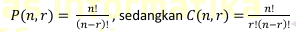

<h1 align = center > <b>  LAPORAN PRATIKUM  MODUL  3<br>  
REVIEW PENGENALAN PEMROGRAMAN </b></h1><p align = center><b>Nama : Alvin Aldino Rahmatullah || NIM : 103112430283</b></p>

<h1>Dasar Teori</h1>
Fungsi merupakan satu kesatuan rangkaian instruksi yang memberikan atau menghasilkan suatu nilai dan biasanya memetakkan input ke suatu nilai yang lain. Oleh karena itu, fungsi selalu menghasilkan/mengembalikan nilai. Suatu subprogram dikatakan fungsi apabila:
1. Ada deklarasi tipe nilai yang dikembalikan
2. Terdapat kata kunci return dalam badan subprogram. Maka fungsi digunakan jika suatu nilai biasanya diperlukan,
seperti: 
- Assignment nilai ke suatu variabel 
- Bagian dari ekspresi 
- Bagian dari argumen suatu subprogram
Karena itu selalu pilih nama fungsi yang menggambarkan nilai, seperti kata benda dan kata sifat. Contoh nama-nama fungsi: median, rerata, nilaiTerbesar, ketemu, selesai.

<h1>Unguided </h1>

<b>Soal 1 </b>
>Minggu ini, mahasiswa Fakultas Informatika mendapatkan tugas dari mata kuliah matematika diskrit untuk mempelajari kombinasi dan permutasi. Jonas salah seorang mahasiswa, iseng untuk mengimplementasikannya ke dalam suatu program. Oleh karena itu bersediakah kalian membantu Jonas? 
>  - <b>Masukkan :</b> terdiri dari empat buah bilangan asli 𝑎, 𝑏, 𝑐, dan 𝑑 yang dipisahkan oleh spasi, dengan syarat 𝑎 ≥ 𝑐 dan 𝑏 ≥ 𝑑.
>  - <b>Keluaran : </b> terdiri dari dua baris. Baris pertama adalah hasil permutasi dan kombinasi 𝒂 terhadap 𝑐, sedangkan baris kedua adalah hasil permutasi dan kombinasi 𝑏 terhadap 𝑑.
>   - <b>Catatan : </b> permutasi (P) dan kombinasi (C) dari 𝑛 terhadap 𝑟 (𝑛 ≥ 𝑟) dapat dihitung dengan menggunakan persamaan berikut!
>   

```go 
package main
import "fmt"

func faktorial(n int) int {
    if n == 0 {
        return 1
    }
    return n * faktorial(n-1)
}

func permutasi(n, r int) int {
    return faktorial(n) / faktorial(n-r)
}

func kombinasi(n, r int) int {
    return faktorial(n) / (faktorial(r) * faktorial(n-r))
}
  
func main() {
    var a, b, c, d int
    fmt.Scan(&a, &b, &c, &d)
    if a >= c && b >= d {
        fmt.Println(permutasi(a, c), kombinasi(a, c))
        fmt.Println(permutasi(b, d), kombinasi(b, d))
    } else {
        fmt.Println("Masukkan angka yang lebih kecil dari angka pertama dan kedua")
    }
}
```

-Output-
> 
> Program ini saya buat untuk membantu jonas menghitung dengan syarat 𝑎 ≥ 𝑐 dan 𝑏 ≥ 𝑑  jika tidak maka akan keluat output "Masukkan angka yang lebih kecil dari angka pertama dan kedua".  Karena soal meminta permutasi dan kombinasi tentu kita membutuhkan faktorial, pada program ini membuat faktorial menggunakan looping seperti di bawah ini :
> `func faktorial(n int) int {
    if n == 0 {
        return 1
    }
    return n * faktorial(n-1)
}`
> Lalu karena di soal telah memberi tau cara untuk membuat permutasi dan kombinasi jadi hanya perlu mengimplementasikan rumus tersebut menjadi code.
> `func permutasi(n, r int) int {
 > return faktorial(n) / faktorial(n-r)
>}
> func kombinasi(n, r int) int {
 > return faktorial(n) / (faktorial(r) * faktorial(n-r))
 >}`