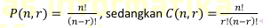
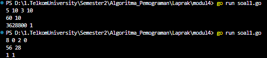
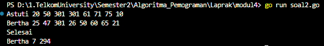
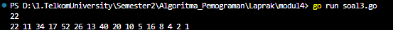

<h1 align = center > <b>  LAPORAN PRATIKUM  MODUL  4<br>  
PROSEDUR</b></h1><p align = center><b>Nama : Alvin Aldino Rahmatullah || NIM : 103112430283</b></p>

<h1>Dasar Teori</h1>
Prosedur dapat dianggap sebagai potongan beberapa instruksi program menjadi suatu instruksi baru yang dibuat untuk mengurangi kerumitan dari kode program yang kompleks pada suatu program yang besar. Prosedur akan menghasilkan suatu akibat atau efek langsung pada program ketika dipanggil pada program utama. Suatu subprogram dikatakan prosedur apabila: 
1. Tidak ada deklarasi tipe nilai yang dikembalikan
2. Tidak terdapat kata kunci return dalam badan subprogram. 
Kedudukannya prosedur sama seperti instruksi dasar yang sudah ada sebelumnya (assignment) dan/atau instruksi yang berasal dari paket (fmt), seperti fmt.Scan dan fmt.Print. Karena itu selalu pilih nama prosedur yang berbentuk kata kerja atau sesuatu yang merepresentasikan proses sebagai nama dari prosedur.

<h1>Unguided </h1>

<b>Soal 1 </b>
> Minggu ini, mahasiswa Fakultas Informatika mendapatkan tugas dari mata kuliah matematika diskrit untuk mempelajari kombinasi dan permutasi. Jonas salah seorang mahasiswa, iseng untuk mengimplementasikannya ke dalam suatu program. Oleh karena itu bersediakah kalian membantu Jonas? 
> <b>Masukan :  </b>terdiri dari empat buah bilangan asli 𝑎, 𝑏, 𝑐, dan 𝑑 yang dipisahkan oleh spasi, dengan syarat 𝑎 ≥ 𝑐 dan 𝑏 ≥ 𝑑. 
> <b>Keluaran :  </b>terdiri dari dua baris. Baris pertama adalah hasil permutasi dan kombinasi 𝒂 terhadap 𝑐, sedangkan baris kedua adalah hasil permutasi dan kombinasi 𝑏 terhadap 𝑑. 
> <b>Catatan : </b>permutasi (P) dan kombinasi (C) dari 𝑛 terhadap 𝑟 (𝑛 ≥ 𝑟) dapat dihitung dengan menggunakan persamaan berikut!
>

```go
package main
import "fmt"

func faktorial(n int, hasil *int) {
    *hasil = 1
    for i := 1; i <= n; i++ {
        *hasil *= i
    }
}

func permutasi(n, r int, hasilPermutasi *int) {
    var faktorialN, faktorialNR int
    faktorial(n, &faktorialN)
    faktorial(n-r, &faktorialNR)
    *hasilPermutasi = faktorialN / faktorialNR
}

func kombinasi(n, r int, hasilKombinasi *int) {
    var faktorialN, faktorialR, faktorialNR int
    faktorial(n, &faktorialN)
    faktorial(r, &faktorialR)
    faktorial(n-r, &faktorialNR)
    *hasilKombinasi = faktorialN / (faktorialR * faktorialNR)
}

func main() {
    var a, b, c, d int
    var permutasi1, kombinasi1, permutasi2, kombinasi2 int
  
    fmt.Scan(&a, &b, &c, &d)

    if a >= c && b >= d {
        permutasi(a, c, &permutasi1)
        kombinasi(a, c, &kombinasi1)
        permutasi(b, d, &permutasi2)
        kombinasi(b, d, &kombinasi2)
  
        fmt.Println(permutasi1, kombinasi1)
        fmt.Println(permutasi2, kombinasi2)
    } else {
        fmt.Println("Masukkan angka yang lebih kecil dari angka pertama dan kedua")
    }
}
```

-Output-


> Program ini saya buat untuk membantu jonas menghitung dengan syarat 𝑎 ≥ 𝑐 dan 𝑏 ≥ 𝑑  jika tidak maka akan menampilkan output "Masukkan angka yang lebih kecil dari angka pertama dan kedua" dan tidak akan menjalankan program lagi.  Karena soal meminta permutasi dan kombinasi tentu kita membutuhkan faktorial, pada program ini membuat faktorial menggunakan looping seperti di bawah ini 
```go
> func faktorial(n int, hasil *int) {
    *hasil = 1
    for i := 1; i <= n; i++ {
        *hasil *= i
    }
}
```
>Berbeda dengan code di modul 3 kali ini memakai * sebagai pointer yang berguna untuk mengembalikan tanpa ada return. Lalu program akan menjalankan penghitungan sesuai dengan rumus yang telah di berikan pada soal, seperti ini
``` go
func permutasi(n, r int, hasilPermutasi *int) {
    var faktorialN, faktorialNR int
    faktorial(n, &faktorialN)
    faktorial(n-r, &faktorialNR)
    *hasilPermutasi = faktorialN / faktorialNR
}

func kombinasi(n, r int, hasilKombinasi *int) {
    var faktorialN, faktorialR, faktorialNR int
    faktorial(n, &faktorialN)
    faktorial(r, &faktorialR)
    faktorial(n-r, &faktorialNR)
    *hasilKombinasi = faktorialN / (faktorialR * faktorialNR)
}
```
Jika penghitungan selesai maka akan muncul ouput dari func main di dalam terminal.

<b>Soal 2 </b>
> Kompetisi pemrograman tingkat nasional berlangsung ketat. Setiap peserta diberikan 8 soal yang harus dapat diselesaikan dalam waktu 5 jam saja. Peserta yang berhasil menyelesaikan soal paling banyak dalam waktu paling singkat adalah pemenangnya. Buat program gema yang mencari pemenang dari daftar peserta yang diberikan. Program harus dibuat modular, yaitu dengan membuat prosedur hitungSkor yang mengembalikan total soal dan total skor yang dikerjakan oleh seorang peserta, melalui parameter formal. Pembacaan nama peserta dilakukan di program utama, sedangkan waktu pengerjaan dibaca di dalam prosedur.
> `prosedure hitungSkor(in/out soal, skor : integer)`
> Setiap baris <b>masukan</b> dimulai dengan satu string nama peserta tersebut diikuti dengan adalah 8 integer yang menyatakan berapa lama (dalam menit) peserta tersebut menyelesaikan soal. Jika tidak berhasil atau tidak mengirimkan jawaban maka otomatis dianggap menyelesaikan dalam waktu 5 jam 1 menit (301 menit). Satu baris keluaran berisi nama pemenang, jumlah soal yang diselesaikan, dan nilai yang diperoleh. Nilai adalah total waktu yang dibutuhkan untuk menyelesaikan soal yang berhasil diselesaikan.
> <b>Keterangan : </b> Astuti menyelesaikan 6 soal dalam waktu 287 menit, sedangkan Bertha 7 soal dalam waktu 294 menit. Karena Bertha menyelesaikan lebih banyak, maka Bertha menang. Jika keduanya menyelesaikan sama banyak, maka pemenang adalah yang menyelesaikan dengan total waktu paling kecil.

```go
package main
import "fmt"
  
func hitungSkor(nama string, soal *int, skor *int) {
    var waktu int
    *soal = 0
    *skor = 0
  
    for i := 0; i < 8; i++ {
        fmt.Scan(&waktu)
        if waktu < 301 {
            *soal++
            *skor += waktu
        }
    }
}
 
func main() {
    var nama, pemenang string
    var soal, skor int
    var maxSoal, minSkor int = -1, 99999

    for {
        fmt.Scan(&nama)
        if nama == "Selesai" {
            break
        }
  
        hitungSkor(nama, &soal, &skor)
  
        if soal > maxSoal || (soal == maxSoal && skor < minSkor) {
            pemenang = nama
            maxSoal = soal
            minSkor = skor
        }
    }
    fmt.Println(pemenang, maxSoal, minSkor)
}
```

-Output-


> Program menentukan pemenang kompetisi pemrograman berdasarkan jumlah soal yang diselesaikan dan total waktu pengerjaan dengan cara memasukkan nama peserta lalu 8 angka yang menunjukkan waktu pengerjaan setiap soal, jika telah selesai ketik "Selesai" untuk mengakhiri program sekaligus untuk menampilkan output yang telah selesai.


<b>Soal 3</b>
>Skiena dan Revilla dalam Programming Challenges mendefinisikan sebuah deret bilangan. Deret dimulai dengan sebuah bilangan bulat n. Jika bilangan n saat itu genap, maka suku berikutnya adalah ½n, tetapi jika ganjil maka suku berikutnya bernilai 3n+1. Rumus yang sama digunakan terus menerus untuk mencari suku berikutnya. Deret berakhir ketika suku terakhir bernilai 1. Sebagai contoh jika dimulai dengan n=22, maka deret bilangan yang diperoleh adalah :
>`22 11 34 17 52 26 13 40 20 10 5 16 8 4 2 1`
>Untuk suku awal sampai dengan 1000000, diketahui deret selalu mencapai suku dengan nilai 1. Buat program skiena yang akan mencetak setiap suku dari deret yang dijelaskan di atas untuk nilai suku awal yang diberikan. Pencetakan deret harus dibuat dalam prosedur cetakDeret yang mempunyai 1 parameter formal, yaitu nilai dari suku awal.
>`prosedure cetakDeret(in n : integer )`
>
><b>Masukan :</b> berupa satu bilangan integer positif yang lebih kecil dari 1000000. 
><b>Keluaran</b> terdiri dari satu baris saja. Setiap suku dari deret tersebut dicetak dalam baris yang dan dipisahkan oleh sebuah spasi.

```go
package main
import "fmt"

func cetakDeret(n int) {
    for n != 1 {
        fmt.Print(n, " ")
        if n%2 == 0 {
            n = n / 2
        } else {
            n = 3*n + 1
        }
    }
    fmt.Print(1)
}

func main() {
    var n int
    fmt.Scan(&n)

    if n < 1 || n >= 1000000 {
        fmt.Println("Input tidak valid")
    } else {
        cetakDeret(n)
    }
}
```

-Output-


> Program ini dibuat untuk mencetak deret angka berdasarkan aturan sebagai berikut:
```go
func cetakDeret(n int) {
    for n != 1 {
        fmt.Print(n, " ")
        if n%2 == 0 {
            n = n / 2
        } else {
            n = 3*n + 1
        }
    }
    fmt.Print(1)
}
```
- Jika bilangan n adalah genap, maka  n = n / 2
- Jika bilangan n adalah ganjil, maka n = 3 * n + 1
- Deret akan terus dihitung hingga mencapai angka **1**, yang menjadi akhir dari urutan.

```go 
func main() {
    var n int
    fmt.Scan(&n)

    if n < 1 || n >= 1000000 {
        fmt.Println("Input tidak valid")
    } else {
        cetakDeret(n)
    }
}
```
User akan memasukkan nilai dari n jika n < 1 atau n besar sama dengan 1000000 maka program akan berhenti dan menampilkan output "input tidak valid" karena hal tersebut tidak sesuai syarat, namun jika tidak maka program akan akan memanggil prosedur cetakDeret(n) untuk menampilkan hasil deretnya
