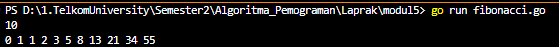
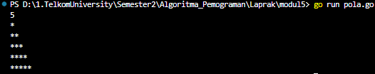
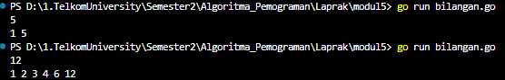
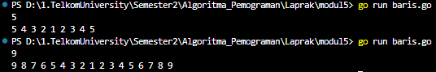
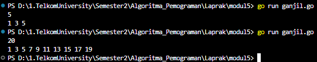
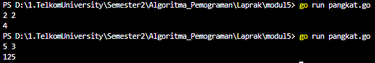

<h1 align = center > <b>  LAPORAN PRATIKUM  MODUL  5<br>  
REKURSIF</b></h1><p align = center><b>Nama : Alvin Aldino Rahmatullah || NIM : 103112430283</b></p>
<h1>Dasar Teori</h1>
Rekursif secara sederhana dapat diartikan sebagai cara menyelesaikan suatu masalah dengan cara menyelesaikan sub-masalah yang identik dari masalah utama.

Teknik rekursif ini merupakan salah satu alternatif untuk mengganti struktur kontrol perulangan dengan memanfaatkan subprogram. 
• Base-case adalah kondisi proses rekursif berhenti. Base-case merupakan hal terpenting dan pertama yang harus diketahui ketika akan membuat program rekursif. Mustahil membuat program rekursif tanpa mengetahui base-case terlebih dahulu.
• Recursive-case adalah kondisi dimana proses pemanggilan dirinya sendiri dilakukan. Kondisi recursive-case adalah komplemen atau negasi dari base-case. 
• Setiap algoritma rekursif selalu memiliki padanan dalam bentuk algoritma interatif.

Algoritma rekursif terdiri dari dua komponen utama: 
• Base-case (Basis), yaitu bagian untuk menghentikan proses rekursif dan menjadi komponen terpenting di dalam sebuah rekursif. 
• Recursive-case, yaitu bagian pemanggilan subprogramnya.

<h1>Unguided </h1>

<b>Soal 1 </b>
> Deret fibonacci adalah sebuah deret dengan nilai suku ke-0 dan ke-1 adalah 0 dan 1, dan nilai suku ke-n selanjutnya adalah hasil penjumlahan dua suku sebelumnya. Secara umum dapat diformulasikan 𝑆𝑛 = 𝑆𝑛−1 + 𝑆𝑛−2 . Berikut ini adalah contoh nilai deret fibonacci hingga suku ke-10. Buatlah program yang mengimplementasikan fungsi rekursif pada deret fibonacci tersebut.
```go
package main
import "fmt"

func fibonacci(n int) int {
    if n <= 1 {
        return n
    }
    return fibonacci(n-1) + fibonacci(n-2)
}

func main() {
    var n int
    fmt.Scan(&n)
  
    for i := 0; i <= n; i++ {
        fmt.Print(fibonacci(i), " ")
    }
} 
```

-Output-
> 
> Program bertugas sebagai penghitung dan menampilkan hasil dari penjumlahan fibonacci yang akan terus di hitung sampai n (input user), hal ini berkerja karena terdapat fungsi fibonacci yang dapat memanggil dirinya sendiri (fibonacci(n-1) + fibonacci(n-2)) hingga mencapai base case (n == 0 atau n == 1). Jika (n == 0 atau n == 1), nilai n langsung dikembalikan karena suku pertama Fibonacci adalah 0 dan suku kedua adalah 1.

<b>Soal 2 </b>
> Buatlah sebuah program yang digunakan untuk menampilkan pola bintang berikut ini dengan menggunakan fungsi rekursif. N adalah masukan dari user.
```go
package main
import "fmt"

func pola(n int, i int) {
    if i > n {
        return
    }

    for j := 0; j < i; j++ {
        fmt.Print("*")
    }

    fmt.Println()
    pola(n, i+1)
}

func main() {
    var n int
    fmt.Scan(&n)
    pola(n, 1)
} 
```

-Output-
>
> Program akan menguluarkan bintang berbentuk segitiga tergantung jumlah angka yang di input user. Program hanya perlu meminta nilai dari n dan pola akan di bentuk dengan menggunakan fungsi rekursif yaitu di bagian pola(n,i), yang akan mencetak 'i' bintang pada setiap baris dan terus memanggil dirinya sendiri hingga mencapai 'n'

<b>Soal 3 </b>
> Buatlah program yang mengimplementasikan rekursif untuk menampilkan faktor bilangan dari suatu N, atau bilangan yang apa saja yang habis membagi N. 
> <b>Masukan : </b> terdiri dari sebuah bilangan bulat positif N. 
> <b>Keluaran : </b> terdiri dari barisan bilangan yang menjadi faktor dari N (terurut dari 1 hingga N ya).
```go
package main
import "fmt"

func bilangan(n int, i int) {
    if i > n {
        return
    }
    
    if n % i == 0 {
        fmt.Print(i, " ")
    }
    bilangan(n, i+1)
}

func main() {
    var n int
    fmt.Scan(&n)
    bilangan(n, 1)
} 
```

-Output-
>
> Program akan menampilkan faktor faktor bilangan dari n menggunakan rekursif, awalnya program akan meminta user untuk memasukkan sebuah angka, lalu fungsi rekursif yang berada pada bilangan(n,i). Jika i habis membagi n maka i akan di cetak sebagai faktor, proses akan terus berjalan sampai mencapai n.

<b>Soal 4 </b>
> Buatlah program yang mengimplementasikan rekursif untuk menampilkan barisan bilangan tertentu. 
> <b>Masukan : </b> terdiri dari sebuah bilangan bulat positif N. 
> <b>Keluaran : </b> terdiri dari barisan bilangan dari N hingga 1 dan kembali ke N.

```go
package main
import "fmt"

func baris(n int) {
    if n == 1 {
        fmt.Print("1 ")
        return
    }
    fmt.Print(n, " ")  
    baris(n - 1)
    fmt.Print(n, " ")
}

func main() {
    var n int
    fmt.Scan(&n)
    
    baris(n)
}
```

-Output-
> 
> Program ini akan mencetak angka dari n sampai 1 lalu kembali lagi menuju n. User hanya perlu mengisi angka yang ingin di masukkan, maka program akan memanggil fungsi baris sebagai pencetak angka sebelum memanggil dirinya sendiri dengan n-1, sehingga nantinya akan mencapai angka 1. Setelah berada di titik ini, fungsi akan kembali ke pemanggilan sebelumnya dan mencetak angka dalam urutan naik hingga kembali ke  n (input user) dan akhirnya akan menampilkan barisan angka dari n sampai n.

<b>Soal 5 </b>
> Buatlah program yang mengimplementasikan rekursif untuk menampilkan barisan bilangan ganjil. 
> <b>Masukan : </b> terdiri dari sebuah bilangan bulat positif N. 
> <b>Keluaran : </b> terdiri dari barisan bilangan ganjil dari 1 hingga N.
```go
package main
import "fmt"
  
func ganjil(n int, i int) {
    if i > n {
        return
    }
    fmt.Print(i, " ")
    ganjil(n, i+2)
}

func main() {
    var n int
    fmt.Scan(&n)
    ganjil(n, 1)
}
```

-Output-
>
>Program ini berguna untuk mencari bilangan ganjil dari 1 sampai n yaitu angka yang di tentukan user, ketika user telah memasukkan angka maka fungsi rekursif akan menjalankan ganjil(n,i) untuk mencetak angka i yang selalu di tambah 2 sampai rentang angka n, jika angka melebihi n maka program akan berhenti dan memunculkan output.


<b>Soal 6 </b>
> Buatlah program yang mengimplementasikan rekursif untuk mencari hasil pangkat dari dua buah bilangan. 
> <b>Masukan : </b> terdiri dari bilangan bulat x dan y. 
> <b>Keluaran : </b> terdiri dari hasil x dipangkatkan y. 
> <b>Catatan : </b> diperbolehkan menggunakan asterik "*", tapi dilarang menggunakan import "math"
```go 
package main
import "fmt"

func pangkat(x int, y int) int {
    if y == 0 {
        return 1
    }
    return x * pangkat(x, y-1)
}

func main() {
    var x, y int
    fmt.Scan(&x, &y)
  
    hasil := pangkat(x, y)
    fmt.Println(hasil)
}```

-Output-
>
>Program bertugas untuk menghitung perpangkatan x dan y dengan cara mengalikan x dengan dirinya sendiri sebanyak y kali, contoh x sebagai 5 dan y sebagai 3, maka 5 akan dikalikan sebanyak 3 kali. program ini menggunakan **rekursi**, di mana fungsi pangkat(x, y) memanggil dirinya sendiri dengan y-1 hingga mencapai base case, yaitu ketika y == 0.
