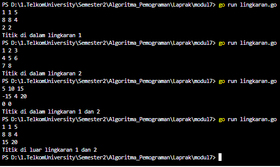
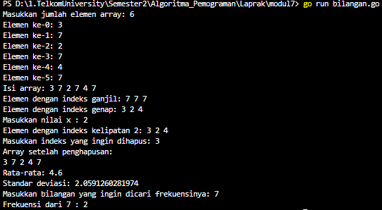
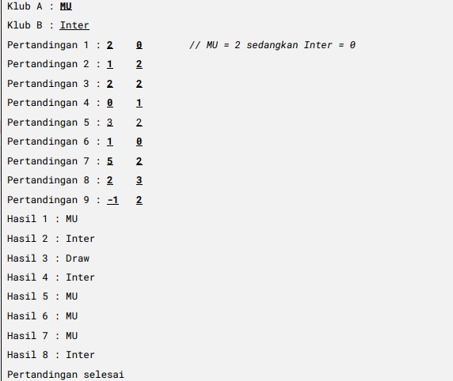
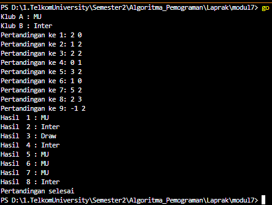
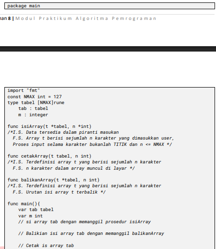
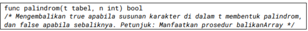
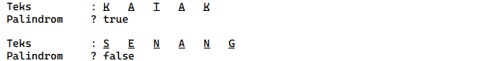
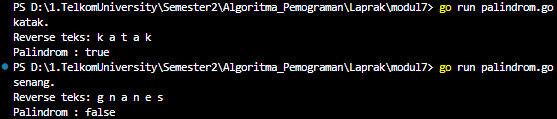

<h1 align = center > <b>  LAPORAN PRATIKUM  MODUL  7<br>  
STRUCT & ARRAY</b></h1><p align = center><b>Nama : Alvin Aldino Rahmatullah || NIM : 103112430283</b></p>

<h1>Dasar Teori</h1>
 **Alias (Type)** Bahasa pemrograman pada umumnya mengizinkan pemrograman untuk mengubah nama suatu tipe data dengan nama baru yang lebih ringkas dan familiar. Sebagai contoh "integer" dapat dirubah dengan nama alias "bilangan ". Caranya dengan menggunakan kata kunci "type".
 **Struct atau Record** (Stucture) memungkinkan pemrograman untuk mengelompokkan beberapa data atau nilai yang memiliki relasi atau keterkaitan tertentu menjadi suatu kesatuan. Masing-masing nilai tersimpan dalam field dari stucture tersebut.
 **Array** adalah larik yang berisi kumpulan data dengan tipe serupa. Teknologi ini dapat digunakan untuk mempermudah penghitungan data karena mengelompokkan data-data berdasarkan kesamaannya
<h1>Unguided </h1>

**Soal 1**
>Suatu lingkaran didefinisikan dengan koordinat titik pusat (𝑐𝑥, 𝑐𝑦) dengan radius 𝑟. Apabila diberikan dua buah lingkaran, maka tentukan posisi sebuah titik sembarang (𝑥, 𝑦) berdasarkan dua lingkaran tersebut. Gunakan tipe bentukan titik untuk menyimpan koordinat, dan tipe bentukan lingkaran untuk menyimpan titik pusat lingkaran dan radiusnya
>**Masukan :** terdiri dari beberapa tiga baris. Baris pertama dan kedua adalah koordinat titik pusat dan radius dari lingkaran 1 dan lingkaran 2, sedangkan baris ketiga adalah koordinat titik sembarang. Asumsi sumbu x dan y dari semua titik dan juga radius direpresentasikan dengan bilangan bulat.
>**Keluaran :** berupa string yang menyatakan posisi titik "Titik di dalam lingkaran 1 dan 2", "Titik di dalam lingkaran 1", "Titik di dalam lingkaran 2", atau "Titik di luar lingkaran 1 dan 2".
>**Catatan :** Lihat paket math dalam lampiran untuk menggunakan fungsi math.Sqrt() untuk menghitung akar kuadrat.
>**-Code-**
```go
package main

import (
    "fmt"
    "math"
)
  
type titik struct {
    x, y float64
}
  
type lingkaran struct {
    pusat titik
    r float64
}
  
func jarak(a, b titik) float64 {
    cx := a.x - b.x
    cy := a.y - b.y
    return math.Sqrt(cx*cx + cy*cy)
}

func didalam(t titik, l lingkaran) bool {
    return jarak(t, l.pusat) <= l.r
}

func main() {
    var l1, l2 lingkaran
    var t titik
  
    fmt.Scan(&l1.pusat.x, &l1.pusat.y, &l1.r)
    fmt.Scan(&l2.pusat.x, &l2.pusat.y, &l2.r)
    fmt.Scan(&t.x, &t.y)

    titik1 := didalam(t, l1)
    titik2 := didalam(t, l2)
  
    if titik1 && titik2 {
        fmt.Println("Titik di dalam lingkaran 1 dan 2")
    } else if titik1 {
        fmt.Println("Titik di dalam lingkaran 1")
    } else if titik2 {
        fmt.Println("Titik di dalam lingkaran 2")
    } else {
        fmt.Println("Titik di luar lingkaran 1 dan 2")
    }
}
```
> **-Output-**
>
>**-Penjelasan Program-**
>Program ini akan menampilkan apakah sebuah titik berada di dalam lingkaran 1 atau lingkaran 2 dan berada di dalam atau di luar kedua lingkaran tersebut, tergantung angka yang akan di input oleh user. 
```
import (
    "fmt"
    "math"
)
  
type titik struct {
    x, y float64
}
  
type lingkaran struct {
    pusat titik
    r float64
}
```
> Pada program ini tidak hanya memakai import berupa fmt tapi juga ada math yang berguna untuk pengoperasian matematika. Pada program ini menggunakan 2 type struct yaitu titik yang berguna untuk menyimpan koordinat (x, y) dan ada juga type lingkaran struct yang terdiri dari pusat berupa titik yang berisikan x,y dan r sebagai radius lingkaran.
```
func jarak(a, b titik) float64 {
    cx := a.x - b.x
    cy := a.y - b.y
    return math.Sqrt(cx*cx + cy*cy)
}

func didalam(t titik, l lingkaran) bool {
    return jarak(t, l.pusat) <= l.r
}
```
> Bagian code ini berisikan Func jarak yang bertugas untuk menghitung "cx" sebagai titik koordinat X sedangkan "cy" sebagai titik koordinat Y. Func didalam bertugas mengembalikan true, jika jarak titik t ke pusat lingkaran l kurang dari atau sama dengan jari-jari Artinya, titik tersebut berada di dalam atau tepat di lingkaran.
```
 var l1, l2 lingkaran
 var t titik
  
    fmt.Scan(&l1.pusat.x, &l1.pusat.y, &l1.r)
    fmt.Scan(&l2.pusat.x, &l2.pusat.y, &l2.r)
    fmt.Scan(&t.x, &t.y)
```
> Bagian func main memiliki variabel yang mendeklarasikan lingkaran (l1, l2) yang memiliki arti lingkaran 1 dan lingkaran 2,  dan satu titik (t) sebagai input dari pengguna. Ada tiga line "fmt.scan" yang masing masing dari mereka akan menerima dan menyimpan input yang berbeda, seperti : line 1 untuk input lingkaran pertama, line 2 untuk input lingkaran ke dua sedangkan line 3 untuk menerima koordinat.
```
    titik1 := didalam(t, l1)
    titik2 := didalam(t, l2)
  
    if titik1 && titik2 {
        fmt.Println("Titik di dalam lingkaran 1 dan 2")
    } else if titik1 {
        fmt.Println("Titik di dalam lingkaran 1")
    } else if titik2 {
        fmt.Println("Titik di dalam lingkaran 2")
    } else {
        fmt.Println("Titik di luar lingkaran 1 dan 2")
    }
```
> Bagian ini memanggil fungsi didalam untuk mengecek apakah titik(t) berada dalam lingkaran 1 (l1) dan lingkaran 2 (l2), lalu akan di simpan ke dalam titik1 dan titik2. Berikutnya adalah logika pengecekan yang memakai percabangan, yaitu : jika titik1 dan titik2 ada di dalam lingkaran akan mengeluarkan output "Titik di dalam lingkaran 1 dan 2" dan begitu seterusnya.


---


**Soal 2**
>Sebuah array digunakan untuk menampung sekumpulan bilangan bulat. Buatlah program yang digunakan untuk mengisi array tersebut sebanyak N elemen nilai. Asumsikan array memiliki kapasitas penyimpanan data sejumlah elemen tertentu. Program dapat menampilkan beberapa informasi berikut: 
>a. Menampilkan keseluruhan isi dari array. 
>b. Menampilkan elemen-elemen array dengan indeks ganjil saja. 
>c. Menampilkan elemen-elemen array dengan indeks genap saja (asumsi indek ke-0 adalah genap). 
>d. Menampilkan elemen-elemen array dengan indeks kelipatan bilangan x. x bisa diperoleh dari masukan pengguna. 
>e. Menghapus elemen array pada indeks tertentu, asumsi indeks yang hapus selalu valid. Tampilkan keseluruhan isi dari arraynya, pastikan data yang dihapus tidak tampil 
>f. Menampilkan rata-rata dari bilangan yang ada di dalam array. 
>g. Menampilkan standar deviasi atau simpangan baku dari bilangan yang ada di dalam array tersebut. 
>h. Menampilkan frekuensi dari suatu bilangan tertentu di dalam array yang telah diisi tersebut.
  **-Code-**
```go
package main

import (
    "fmt"
    "math"
)

const NMAX = 100

func isiArray(arr *[NMAX]int, n *int) {
    fmt.Print("Masukkan jumlah elemen array: ")
    fmt.Scan(n)
    for i := 0; i < *n; i++ {
        fmt.Print("Elemen ke-", i, ": ")
        fmt.Scan(&arr[i])
    }
}

func cetakArray(arr [NMAX]int, n int) {
    fmt.Print("Isi array: ")
    for i := 0; i < n; i++ {
        fmt.Print(arr[i], " ")
    }
    fmt.Println()
}

func cetakGanjil(arr [NMAX]int, n int) {
    fmt.Print("Elemen dengan indeks ganjil: ")
    for i := 1; i < n; i += 2 {
        fmt.Print(arr[i], " ")
    }
    fmt.Println()
}

func cetakGenap(arr [NMAX]int, n int) {
    fmt.Print("Elemen dengan indeks genap: ")
    for i := 0; i < n; i += 2 {
        fmt.Print(arr[i], " ")
    }
    fmt.Println()
}

func cetakKelipatan(arr [NMAX]int, n int, x int) {
    fmt.Print("Elemen dengan indeks kelipatan ", x, ": ")
    for i := 0; i < n; i++ {
        if i%x == 0 {
            fmt.Print(arr[i], " ")
        }
    }
    fmt.Println()
}

func hapusIndeks(arr *[NMAX]int, n *int, index int) {
    for i := index; i < *n-1; i++ {
        arr[i] = arr[i+1]
    }
    *n--
    fmt.Println("Array setelah penghapusan:")
    for i := 0; i < *n; i++ {
        fmt.Print(arr[i], " ")
    }
    fmt.Println()
}
  
func rataRata(arr [NMAX]int, n int) float64 {
    total := 0
    for i := 0; i < n; i++ {
        total += arr[i]
    }
    return float64(total) / float64(n)
}

func standarDeviasi(arr [NMAX]int, n int) float64 {
    rerata := rataRata(arr, n)
    total := 0.0
    for i := 0; i < n; i++ {
        selisih := float64(arr[i]) - rerata
        total += selisih * selisih
    }
    return math.Sqrt(total / float64(n))
}

func frekuensi(arr [NMAX]int, n int, target int) int {
    count := 0
    for i := 0; i < n; i++ {
        if arr[i] == target {
            count++
        }
    }
    return count
}
  
func main() {
    var arr [NMAX]int
    var n int
  
    isiArray(&arr, &n)
    cetakArray(arr, n)
    cetakGanjil(arr, n)
    cetakGenap(arr, n)
  
    var x int
    fmt.Print("Masukkan nilai x : ")
    fmt.Scan(&x)
    cetakKelipatan(arr, n, x)
  
    var idxHapus int
    fmt.Print("Masukkan indeks yang ingin dihapus:")
    fmt.Scan(&idxHapus)
    hapusIndeks(&arr, &n, idxHapus)

    fmt.Println("Rata-rata:", rataRata(arr, n))
    fmt.Println("Standar deviasi:", standarDeviasi(arr, n))

    var cari int
    fmt.Print("Masukkan bilangan yang ingin dicari frekuensinya: ")
    fmt.Scan(&cari)
    fmt.Println("Frekuensi dari", cari, ":", frekuensi(arr, n, cari))
}
```
>**-Code-**
>
>**-Penjelasan Program-**
Program di atas digunakan untuk melakukan berbagai operasi terhadap sebuah array bilangan bulat berdasarkan input dari user. Fungsi "isiArray" digunakan untuk mengisi elemen array sebanyak n buah dari input user. Fungsi "cetakArray", "cetakGanjil", dan "cetakGenap" bertugas mencetak isi array secara keseluruhan, hanya elemen dengan indeks ganjil, dan hanya elemen dengan indeks genap. Fungsi "cetakKelipatan" menampilkan elemen array yang memiliki indeks kelipatan x, yang juga dimasukkan oleh pengguna. Fungsi "hapusindeks" digunakan untuk menghapus elemen array pada indeks tertentu dan menggeser elemen-elemen setelahnya agar posisi array tetap teratur. Setelah penghapusan, array dicetak ulang tanpa label "Isi array:" sesuai permintaan. Fungsi "rataRata" menghitung nilai rata-rata dari elemen-elemen dalam array, sedangkan "standarDeviasi" digunakan untuk menghitung seberapa tersebar data dari nilai rata-ratanya menggunakan rumus standar deviasi. Terakhir, fungsi "frekuensi" menghitung seberapa sering suatu bilangan muncul di dalam array. Seluruh fungsi ini dipanggil secara berurutan dalam fungsi "main", sesuai dengan urutan input user.


---


**Soal 3**
> Sebuah program digunakan untuk menyimpan dan menampilkan nama-nama klub yang memenangkan pertandingan bola pada suatu grup pertandingan. Buatlah program yang digunakan untuk merekap skor pertandingan bola 2 buah klub bola yang berlaga. Pertama-tama program meminta masukan nama-nama klub yang bertanding, kemudian program meminta masukan skor hasil pertandingan kedua klub tersebut. Yang disimpan dalam array adalah nama-nama klub yang menang saja. Proses input skor berhenti ketika skor salah satu atau kedua klub tidak valid (negatif). Di akhir program, tampilkan daftar klub yang memenangkan pertandingan.
> 
>**Perhatikan sesi interaksi pada contoh berikut ini (teks bergaris bawah adalah input/read)**
>
>**-Code-**
```go
package main

import "fmt"

type Klub struct {
    nama string
    skor []int
}
  
func main() {
    var klubA, klubB Klub

    fmt.Print("Klub A : ")
    fmt.Scanln(&klubA.nama)
  
    fmt.Print("Klub B : ")
    fmt.Scanln(&klubB.nama)

    pertandingan := 1
  
    for {
        var skorA, skorB int
        fmt.Print("Pertandingan ke ", pertandingan, ": ")
        fmt.Scan(&skorA, &skorB)
  
        if skorA < 0 || skorB < 0 {
            break
        }

        klubA.skor = append(klubA.skor, skorA)
        klubB.skor = append(klubB.skor, skorB)
        pertandingan++
    }

    for i := 0; i < len(klubA.skor); i++ {
        hasil := ""
        if klubA.skor[i] > klubB.skor[i] {
            hasil = klubA.nama
        } else if klubA.skor[i] < klubB.skor[i] {
            hasil = klubB.nama
        } else {
            hasil = "Draw"
        }

        fmt.Println("Hasil ", i+1, ":", hasil)
    }
  
    fmt.Println("Pertandingan selesai")
}
```
>**-Output-**
>
>**-Penjelasan Program-**
>Program akan menampilkan nama klub sepak bola yang menang atau draw dalam beberapa pertandingan, program akan berhenti jika user memasukkan angka yang tidak valid dalam skor seperti bilangan negatif 
```
 type Klub struct {
    nama string
    skor []int
}
```
>Struct klub memiliki dua field yang di definisikan sebagai tempat menyimpan data nama yang bertipe string untuk menyimpan nama klub sepak bola yang di isi user dan ada juga skor yang ber tipe data integer namun memiliki array untuk menyimpan data skor dari setiap pertandingan, dengan adanya struct menurut saya akan lebih rapi dalam mengelompokan
```
var klubA, klubB Klub

    fmt.Print("Klub A : ")
    fmt.Scanln(&klubA.nama)
  
    fmt.Print("Klub B : ")
    fmt.Scanln(&klubB.nama)

```
> Ini adalah bagian deklarasi variabel yaitu klubA dan KlubB bertipe klub, dengan begitu program akan meminta user untuk mengisi dua nama klub yang ia mau, lalu "fmt.scan" akan membaca input dan akan menyimpan ke dalam field "nama".
```
 pertandingan := 1
  
    for {
        var skorA, skorB int
        fmt.Print("Pertandingan ke ", pertandingan, ": ")
        fmt.Scan(&skorA, &skorB)
  
        if skorA < 0 || skorB < 0 {
            break
        }

        klubA.skor = append(klubA.skor, skorA)
        klubB.skor = append(klubB.skor, skorB)
        pertandingan++
    }
```
> Variabel pertandingan digunakan untuk menghitung jumlah pertandingan yang akan bertambah setiap kali berjalan, lalu for akan mengulang meminta input secara terus tapi jika bertemu dengan angka negatif maka program akan berhenti tapi jika belum maka "fmt.scan" akan terus menyimpan data skor dalam masing masing variabel. Fungsi "append()" digunakan untuk menambahkan skor ke dalam array skor milik masing-masing klub dan "pertandingan++" menambah nomor pertandingan setiap kali loop berlangsung
```
for i := 0; i < len(klubA.skor); i++ {
        hasil := ""
        if klubA.skor[i] > klubB.skor[i] {
            hasil = klubA.nama
        } else if klubA.skor[i] < klubB.skor[i] {
            hasil = klubB.nama
        } else {
            hasil = "Draw"
        }

        fmt.Println("Hasil ", i+1, ":", hasil)
    }
  
    fmt.Println("Pertandingan selesai")
}
```
>For akan terus berjalan sebanyak skor yaitu jumlah pertandingan yang telah di input user sebelum memasukkan input yang tidak valid (yang di hitung hanya skor valid) dan konsep pecabangan juga di pakai lagi untuk membandingkan klubA dan klubB jika salah satu dari klub lebih besar maka program akan menampilkan nama klub tersebut namun jika kondisi tersebut tidak dapat terpenuhi maka else akan berjalan yaitu akan mengeluarkan hasil "Draw" dan akan terus berulang sampai jumlah pertandingan yang tersimpan habis. Program akan berhenti setelah perbandingan selesai dan menampilkan output  "Pertandingan selesai"


---


> **Soal 4**
> Sebuah array digunakan untuk menampung sekumpulan karakter, Anda diminta untuk membuat sebuah subprogram untuk melakukan membalikkan urutan isi array dan memeriksa apakah membentuk palindrom. Lengkapi potongan algoritma berikut ini!
> 
> Perhatikan sesi interaksi pada contoh berikut ini (teks bergaris bawah adalah input/read)
> 
> Modifikasi program tersebut dengan menambahkan fungsi palindrom. Tambahkan instruksi untuk memanggil fungsi tersebut dan menampilkan hasilnya pada program utama. Palindrom adalah teks yang dibaca dari awal atau akhir adalah sama, contoh: KATAK, APA, KASUR_RUSAK.
> 
> Perhatikan sesi interaksi pada contoh berikut ini (teks bergaris bawah adalah input/read)
> 
>**-Code-**
```go
package main

import "fmt"
  
const NMAX int = 127
  
type tabel [NMAX]rune
  
func isiArray(t *tabel, n *int) {
    var char rune
    *n = 0
    for {
        fmt.Scanf("%c", &char)
        if char == '.' || *n >= NMAX {
            break
        }
        t[*n] = char
        *n++
    }
}

func cetakArray(t tabel, n int) {
    for i := 0; i < n; i++ {
        fmt.Printf("%c ", t[i])
    }
    fmt.Println()
}

func balikanArray(t *tabel, n int) {
    for i := 0; i < n/2; i++ {
        t[i], t[n-1-i] = t[n-1-i], t[i]
    }
}

func palindrom(t tabel, n int) bool {
    for i := 0; i < n/2; i++ {
        if t[i] != t[n-1-i] {
            return false
        }
    }
    return true
}

func main() {
    var tab tabel
    var m int

    isiArray(&tab, &m)
    fmt.Print("Reverse teks: ")
    balikanArray(&tab, m)
    cetakArray(tab, m)
    
    balikanArray(&tab, m)
    
    fmt.Print("Palindrom : ")
    fmt.Println(palindrom(tab, m))

}
```
>**-Output-**
>
>**-Penjelasan Program-**
> Program ini membuat sebuah kata yang dapat menghasilkan kata yang sama jika di balik, hal ini dinamakan palindrom dan pada pembuatan program ini telah di berikan pseudocode jadi saya perlu implementasikan nya ke dalam sebuah program.
```
const NMAX int = 127
type tabel [NMAX]rune
```
>NMAX berfungsi untuk menyatakan kapasitas maximum array yaitu sejumlah 127 karakter, lalu tabel adalah array yang berurukan 127 yang bertipe rune, yaitu karakter Unicode yang berarti nilai integer unik yang sesuai dengan karakter dalam standar Unicode.
```
func isiArray(t *tabel, n *int) {
    var char rune
    *n = 0
    for {
        fmt.Scanf("%c", &char)
        if char == '.' || *n >= NMAX {
            break
        }
        t[*n] = char
        *n++
    }
}

func cetakArray(t tabel, n int) {
    for i := 0; i < n; i++ {
        fmt.Printf("%c ", t[i])
    }
    fmt.Println()
}
```
> Func isiArray akan membaca karakter melalui "fmt.Scanf("%c", &char)" dan menyimpan karakter ke dalam array hingga user mengetik titik "." , lalu pointer "n" akan menyimpan jumlah karakter yang dimasukkan. lalu func cetakArray akan mencetak semua karakter dari array sebanya "n" dan di pisahkan oleh spasi.
```
func balikanArray(t *tabel, n int) {
    for i := 0; i < n/2; i++ {
        t[i], t[n-1-i] = t[n-1-i], t[i]
    }
}

func palindrom(t tabel, n int) bool {
    for i := 0; i < n/2; i++ {
        if t[i] != t[n-1-i] {
            return false
        }
    }
    return true
}
```
> Seperti namanya func balikinArray akan menukar yang posisinya di awal menjadi belakang secara satu persatu dan akan menjadi hasil yang terbalik, seperti : kasur menjadi rusak. Func palindrom yang sangat berperan pada hasil akhir, program akan mengecek apakah karakter ke i dari depan sampai belakang sama, jika tidak sama maka tidak palindrom tapi jika ya maka true.
```
func main() {
    var tab tabel
    var m int

    isiArray(&tab, &m)
    fmt.Print("Reverse teks: ")
    balikanArray(&tab, m)
    cetakArray(tab, m)
    
    balikanArray(&tab, m)
    
    fmt.Print("Palindrom : ")
    fmt.Println(palindrom(tab, m))

}
```
> Pertama program akan memanggil isiarray untuk membaca input karakter ke "tab", hasil panjangnya akan disimpan di "m". BalikanArray membakik isi array dan mencetak hasilnya, lalu di cek apakah array palindrom jika ya maka true dan jika tidak maka output false. 